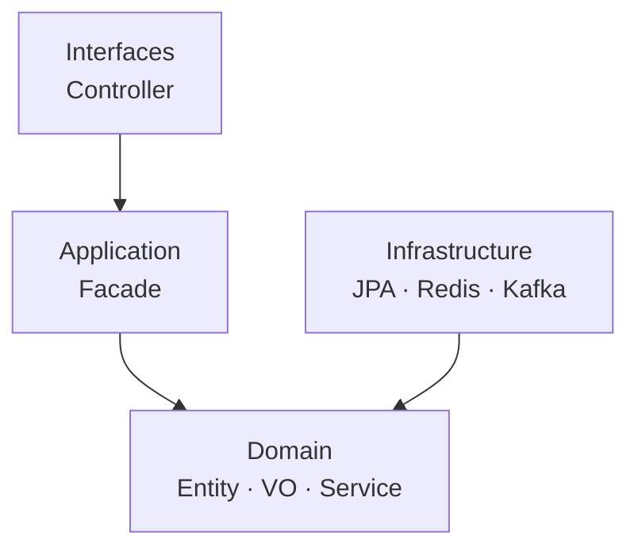

`상품.likeCount++` 로 좋아요를 구현했다고 합시다. 곧 "누가, 언제, 무엇에 눌렀는지" 추적이 필요해지고, 결국 `Like` 를 독립된 도메인으로 떼어내게 됩니다. **도메인 모델링** 은 이런 결정을 미리 내리는 일이에요.

## 모델링은 데이터가 아니라 책임이다

도메인 모델링은 단순한 클래스 설계가 아니라, 현실의 개념과 규칙을 **객체의 행위와 책임**으로 옮기는 작업입니다. 비즈니스 의미가 커질 수 있는 개념은 처음부터 도메인 단위로 격리하는 편이 응집도와 확장성에 유리해요.

## Entity · VO · Domain Service

설계의 출발은 객체의 성격을 구분하는 것입니다.

| 종류 | 성격 | 예시 |
| --- | --- | --- |
| Entity | 고유 ID로 동일성 판단, 상태가 변함 | User, Order, Product |
| Value Object | 값 자체가 정체성인 불변 객체 | Money, Address, Quantity |
| Domain Service | 상태 없이 여러 객체 협력 로직 위임 | PointChargingService |

VO와 Entity의 경계는 **맥락(Context)에 따라 달라집니다.** 보통 `Address` 는 VO지만, 우체국처럼 주소를 추적해야 하는 도메인에선 식별자를 갖는 Entity가 될 수 있어요.

```java
record Money(BigDecimal amount) {
    Money {
        if (amount.signum() < 0)
            throw new IllegalArgumentException("금액은 0 이상");
    }
    Money plus(Money o) {
        return new Money(amount.add(o.amount));
    }
}
```

## "하는 놈"은 도메인이 아니라 서비스다

고유한 상태나 정체성 없이 계산·전송·처리 같은 **연산 하나만** 하는 객체는 도메인 개념처럼 위장하면 안 됩니다. 서비스의 특징은 둘 — _상태가 없어_ 입력/출력이 명확하고, _클라이언트에게 무언가를 제공_ 하는 모듈이라는 것. 도메인 모델을 더럽히지 않고 로직을 분리하는 용도로 쓰입니다.

## 의존성은 도메인을 향한다 (DIP)

레이어드 아키텍처에서 모든 의존 방향이 **도메인을 향하게** 만드는 게 핵심입니다. 그냥 두면 도메인이 DB를 쓰니 _도메인 → 인프라_ 로 의존하게 되는데, 이러면 DB가 바뀔 때 도메인이 흔들려요. 그래서 **Repository 인터페이스를 도메인에 두고**(무엇이 필요한지는 도메인이 선언), 그 **구현체를 인프라에 둡니다**(어떻게 할지는 인프라가 책임). 그러면 화살표가 뒤집혀 _인프라 → 도메인_ 이 되죠 — 이게 **의존성 역전(DIP)** 입니다. 덕분에 DB를 갈아끼워도 도메인은 그대로고, 테스트 땐 진짜 DB 대신 메모리에 담는 가짜 구현(Fake)을 끼워 도메인만 독립적으로 검증할 수 있습니다.

```java
// 도메인 계층 — 인터페이스
interface OrderRepository {
    Order save(Order order);
}

// 인프라 계층 — 구현체
@Repository
class OrderRepositoryImpl implements OrderRepository {
    public Order save(Order order) { ... }
}
```



<div class="callout callout-tip"><span class="callout-label">KEY POINT</span>중요한 건 레이어드냐 헥사고날이냐 클린이냐가 <b>아닙니다.</b> 모든 의존성이 도메인을 향하게 만들어 도메인이 스스로를 책임지는 구조여야, 그때 비로소 <em>테스트 가능한 코드</em>가 됩니다.</div>

## 참고

- [도메인 주도 설계 — 위키백과](https://ko.wikipedia.org/wiki/%EB%8F%84%EB%A9%94%EC%9D%B8_%EC%A3%BC%EB%8F%84_%EC%84%A4%EA%B3%84)
- [객체 지향 원칙 SOLID — 나무위키](https://namu.wiki/w/%EA%B0%9D%EC%B2%B4%20%EC%A7%80%ED%96%A5%20%ED%94%84%EB%A1%9C%EA%B7%B8%EB%9E%98%EB%B0%8D/%EC%9B%90%EC%B9%99)
- [Layered Architecture — Baeldung](https://www.baeldung.com/cs/layered-architecture)
- [디자인 패턴 — 리팩토링 구루](https://refactoring.guru/ko/design-patterns)
