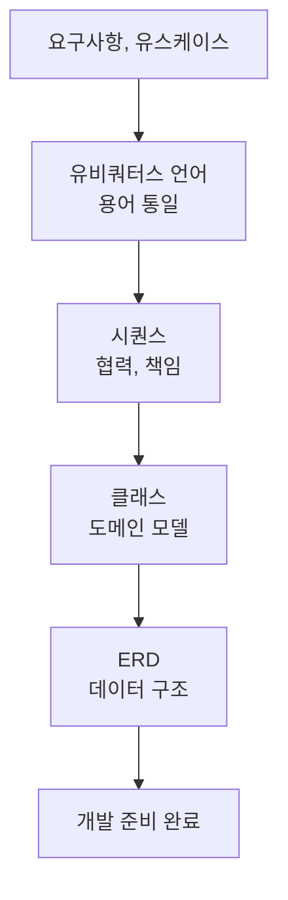

구현을 다 끝냈는데 "이건 제가 원한 게 아니에요"를 듣는다면, 코드가 아니라 **설계를 건너뛴** 탓일 때가 많습니다. 요구사항이 도메인 모델과 ERD로 옮겨가는 흐름을 따라가 봅니다.

## 요구사항부터 유스케이스로

먼저 유저 시나리오를 자연어로 도출하고, **행위 중심 기능 목록**으로 정리한 뒤, 유스케이스 흐름을 씁니다. 이때 정상 흐름(Main)만이 아니라 **대안, 예외 흐름**(Alternate / Exception)까지 빠짐없이 적어야 해요. 기능만 나열하고 "로그인 여부" 같은 조건 분기를 빠뜨리면, 명세와 구현이 점점 벌어집니다.

## 유비쿼터스 언어 — 같은 단어로 합의

누구는 '상품', 누구는 '아이템'이라 부르면 설계가 어긋납니다. **유비쿼터스 언어** 는 모든 협업자가 같은 단어로 같은 개념을 가리키게 만드는 용어 체계예요. 기능 문서, ERD, API, 클래스명에 동일한 단어(상품→`Product`, 좋아요→`Like`)를 쓰고, enum, 상태값에 '상태1, 상태2' 같은 의미 없는 이름을 두지 않습니다.

KEY POINT설계는 '그림 그리기'가 아니라 <b>같은 언어로 합의하는 일</b>입니다. 용어가 어긋나면(상품 vs 아이템) 시퀀스도 클래스도 ERD도 같이 어긋나요. 유비쿼터스 언어가 모든 산출물의 정합성을 떠받칩니다.

## 시퀀스 — 누가 무엇을 책임지나

시퀀스 다이어그램은 "누가 무엇을 책임지는가"를 **객체 간 메시지 흐름**으로 드러냅니다. 기능 하나당 시퀀스 하나가 원칙. 사용자→Controller→Application→Domain→Infra 흐름과 조건 분기, 이벤트 발행을 표현하되, 도메인 객체 간 메시지 없이 Service만 호출하거나 다이어그램과 구현이 따로 노는 걸 경계합니다.

## 클래스와 ERD로 잇기

도메인 모델은 객체의 **책임과 관계**를 설계해 코드로 잇고, ERD는 그 물리적 구현이자 성능과 직결되는 데이터 구조입니다. 1:N은 외래키, N:M은 조인 테이블, enum은 코드 테이블이나 VARCHAR, 삭제는 행을 지우는 대신 `deleted_at` 에 시각을 남기는 **soft delete**, 상태 변화는 `status` 컬럼으로 명시합니다. 반대로 `Price` 처럼 _상품에 딸린 값_ 을 별도 테이블로 빼는 건 잘못된 방향이에요 — 자기만의 식별자도 생명주기도 없는 값이라, 컬럼 하나면 될 걸 테이블로 만들면 조회할 때마다 불필요한 조인만 늘어납니다.

설계 산출물은 따로 노는 그림이 아니라, **위에서 아래로 같은 언어로 변환되는 한 줄기**입니다. 그래서 출발점의 용어 합의가 가장 중요합니다.

## 참고

- [도메인 주도 설계 — MSA School](https://www.msaschool.io/operation/design/design-two/)
- [시퀀스 다이어그램 — IBM Docs](https://www.ibm.com/docs/ko/rsas/7.5.0?topic=uml-sequence-diagrams)
- [ER 다이어그램 — Lucidchart](https://www.lucidchart.com/pages/er-diagrams)
