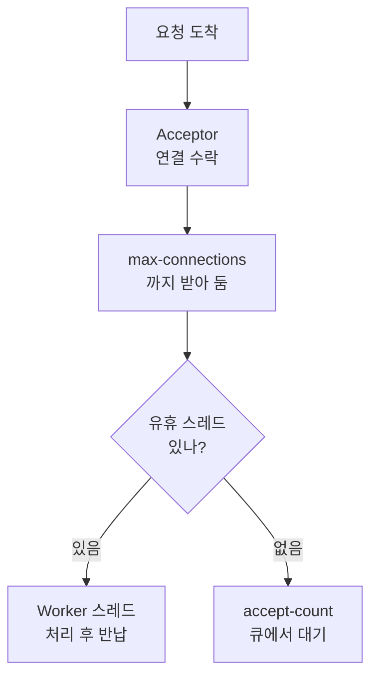

컨트롤러 코드 어디에도 스레드를 만드는 줄이 없는데, 사용자 200명이 동시에 들어와도 스프링부트는 멀쩡히 응답합니다. 비밀은 내가 짠 코드가 아니라 **내장 톰캣**(스프링부트가 안에 품고 띄우는 웹 서버)에 있어요. 요청 하나가 어디서 받아지고, 누가 처리하고, 다 차면 무슨 일이 생기는지 따라가 봅니다.

## 요청 하나에 스레드 하나

스프링부트 기본 모델은 _thread per request_, 즉 요청 하나당 스레드 하나입니다. 톰캣은 미리 만들어 둔 **스레드 풀**에서 유휴 스레드를 꺼내 요청을 처리하고, 끝나면 다시 풀에 반납해요. 매번 스레드를 새로 만들지 않고 _재사용_ 합니다.

여기서 바로 나오는 결론 하나. 풀의 스레드가 200개면 _그 순간_ 동시에 처리되는 요청도 최대 200개입니다. 201번째 요청은 스레드가 빌 때까지 기다려야 해요. 그래서 한 요청이 느린 외부 API를 20초씩 붙잡고 있으면, 그 20초 동안 스레드 하나가 통째로 묶여 다른 요청을 못 받습니다. 이게 스레드 풀 고갈(pool exhaustion)이에요.

## 받는 쪽과 일하는 쪽은 분리돼 있다

톰캣은 역할을 둘로 나눕니다.

- **Acceptor**: 소켓 연결을 _수락_ 만 하는 담당. 받은 연결을 큐에 넣고 곧장 다음 연결을 받으러 갑니다.
- **Worker 스레드 풀**: 큐에 쌓인 연결을 꺼내 실제 요청을 _처리_ 하는 담당.

연결을 받는 일과 요청을 처리하는 일이 떨어져 있기 때문에, 처리할 스레드가 모자라도 연결 자체는 일단 받아 둘 수 있습니다. 이 구조가 다음에 나올 설정값들의 의미를 정합니다.

## 용량을 정하는 톰캣 설정 4개

`application.yml` 에서 조절하는 핵심 값은 네 개입니다.

```yaml
server:
  tomcat:
    threads:
      max: 200          # 워커 스레드 최대
      min-spare: 10     # 항상 떠 있는 유휴 스레드
    accept-count: 100   # 대기 큐 길이
    max-connections: 8192  # 받아둘 연결 총량
```

| 설정 | 기본값 | 의미 |
| --- | --- | --- |
| `threads.max` | 200 | 동시에 _처리_ 가능한 요청 수 |
| `threads.min-spare` | 10 | 미리 띄워 두는 최소 스레드 |
| `accept-count` | 100 | 스레드가 다 찼을 때 OS가 대기시키는 큐 |
| `max-connections` | 8192 | 수립해 둘 수 있는 연결 총 개수 |

핵심은 **max-connections**(8192)가 **threads.max**(200)보다 훨씬 크다는 점입니다. 연결은 8천 개까지 받아 두되, 실제로 동시에 _일하는_ 스레드는 200개라는 뜻이에요. 받는 능력과 처리하는 능력을 따로 잡아 둔 겁니다.

## BIO에서 NIO로, 적은 스레드로 많은 연결

"연결 8천 개를 받아 두는데 스레드는 200개"가 어떻게 가능할까요? 커넥터(connector) 방식이 바뀌었기 때문입니다.

- **BIO**(Blocking I/O): 연결 하나가 스레드 하나를 _연결이 끝날 때까지_ 통째로 점유합니다. 데이터를 안 보내고 가만히 있는 연결도 스레드를 물고 있어 낭비가 큽니다. 톰캣 9에서 제거됐어요.
- **NIO**(Non-blocking I/O): `Selector` 하나가 여러 연결(채널)을 감시하다가, _실제로 읽고 쓸 데이터가 준비된_ 연결에만 워커 스레드를 붙입니다. 대기 중인 연결은 스레드를 안 잡아요. 그래서 적은 스레드로 많은 연결을 감당합니다. 톰캣 8부터 기본값입니다.

정리하면 NIO 덕분에 "연결 수 > 스레드 수"가 자연스러워졌고, max-connections와 max-threads를 따로 두는 설계가 의미를 갖게 됐습니다.



## 다 차면 무슨 일이 생기나

부하가 올라가면 단계적으로 막힙니다.

1. 워커 스레드 200개가 _전부_ 사용 중이 되면, 새 요청은 곧바로 처리되지 못합니다.
2. 새로 들어온 연결은 **accept-count**(100) 크기의 OS 대기 큐에 줄을 섭니다. 스레드가 하나 비는 순간 큐 앞에서 꺼내 처리해요.
3. 그 대기 큐마저 꽉 차면 그때부터 연결이 **거부**(connection refused)됩니다.

즉 `threads.max`는 처리 속도의 상한, `accept-count`는 버틸 수 있는 여유분, `max-connections`는 받아 둘 연결의 총량입니다. 세 값을 무작정 키우면 메모리와 컨텍스트 스위칭 비용이 따라 늘기 때문에, 응답 시간과 외부 의존성(DB 커넥션 풀 크기 등)에 맞춰 균형을 잡아야 합니다.

<div class="callout callout-q"><span class="callout-label">한 걸음 더</span>스레드를 늘리는 것보다 <b>스레드를 빨리 반납하게</b> 만드는 게 먼저입니다. 느린 외부 호출에 타임아웃을 걸어(기본 connection-timeout은 20초) 스레드가 무한정 묶이지 않게 하고, DB 커넥션 풀이 톰캣 스레드 수를 못 따라가면 스레드를 늘려도 그 앞에서 막힙니다. 병목은 보통 스레드 개수가 아니라 <em>하류 자원</em>에 있습니다.</div>

## 참고

- [How does Spring Boot handle multiple requests? — sihyung92](https://velog.io/@sihyung92/how-does-springboot-handle-multiple-requests)
- [Tomcat HTTP Connector 설정 (Connector Comparison) — 공식 문서](https://tomcat.apache.org/tomcat-9.0-doc/config/http.html)
- [Spring Boot Common Application Properties (server.tomcat) — 공식 문서](https://docs.spring.io/spring-boot/appendix/application-properties/index.html)
