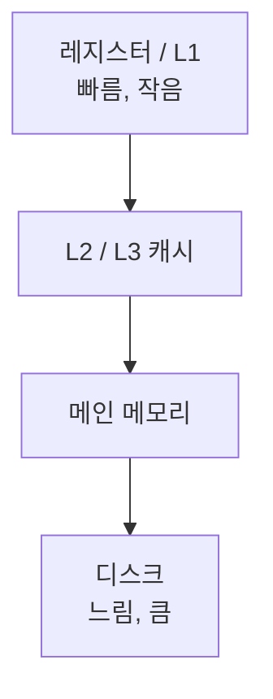

CPU는 1초에 수십억 번 연산하는데, 메인 메모리는 그보다 한참 느립니다. 이 속도차를 메우는 게 **캐시** 예요. (OS의 가상 메모리, 애플리케이션의 Redis 캐시와는 층이 다른, 하드웨어 이야기입니다.)

## 속도와 용량은 반비례, 그래서 계층

빠른 저장장치는 비싸고 작습니다. 그래서 메모리를 계층으로 쌓아요.



위로 갈수록 빠르고 작습니다. 찾던 데이터가 아래 계층에 있으면 위로 복사해 둬, 다음엔 더 빠르게 꺼냅니다.

## 지역성, 캐시가 통하는 이유

캐시는 **지역성** 이라는 경향에 기댑니다.

- **시간 지역성**: 방금 쓴 데이터를 곧 또 쓴다(반복문 변수).
- **공간 지역성**: 쓴 데이터 근처를 곧 쓴다(배열 순차 접근).

"다음에 쓸 법한 것"을 미리 들고 있으면 적중하는 이유가 여기 있어요.

## 적중률과 평균 접근시간

캐시에 있으면 Hit, 없으면 Miss입니다. 적중률 H는 적중 횟수를 전체 접근으로 나눈 값이에요. 평균 메모리 접근시간(AMAT)은 이렇게 나옵니다.

```text
AMAT = H × T캐시 + (1 - H) × T메모리

T캐시 50ns, T메모리 400ns 일 때
  H 90% → 0.9×50 + 0.1×400 = 85ns
  H 95% → 67.5ns
```

적중률 몇 퍼센트포인트 차이가 평균 속도를 크게 가릅니다. 캐시 설계가 적중률에 목매는 이유예요.

## MMU, 주소를 바꿔주는 길목

CPU가 보는 논리 주소를 실제 물리 주소로 바꾸는 게 **MMU** 입니다. 논리 주소에 기준 레지스터(Base)를 더해 변환하고, 허용 범위(Base부터 Base+Limit까지)를 벗어나면 차단해 다른 프로그램의 메모리 침범을 막아요.

<div class="callout callout-q"><span class="callout-label">한 걸음 더</span>같은 "캐시"라도 층이 다릅니다. 이 글의 <b>CPU 캐시</b>(하드웨어 L1/L2/L3), OS의 <b>가상 메모리</b>(페이지), 애플리케이션의 <b>Redis</b>(TTL 캐시)는 각자 다른 속도차를 메워요. 공통 원리는 하나입니다 — 자주 쓰는 걸 빠른 곳에 둔다. 사이트의 "메모리가 부족할 때, 가상 메모리"와 "캐시 전략" 글이 나머지 두 층을 다룹니다.</div>

## 참고

- [말이 트이는 컴퓨터 구조 — 인프런](https://www.inflearn.com/courses/lecture?courseId=337646&unitId=313756)
- [CPU 캐시 — 위키백과](https://ko.wikipedia.org/wiki/CPU_캐시)
