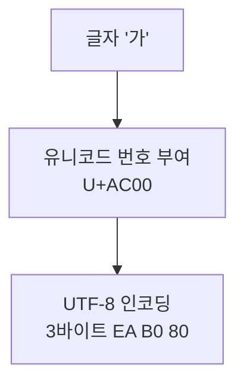

'A'도 '가'도 결국 숫자입니다. 각 글자에 번호를 매기고, 그 번호를 바이트로 바꾸는 규칙의 역사를 따라가 봅니다. 글자가 깨지는 이유도 여기서 풀립니다.

## ASCII, 영어를 위한 7비트

**ASCII** 는 7비트로 128자를 표현합니다(0번부터 127번). 'A'는 65, 'a'는 97이에요. 영어와 숫자, 기호엔 충분하지만 한글이나 한자는 담을 수 없습니다. 남는 1비트는 전송 오류를 잡는 패리티로 쓰기도 했어요.

## 유니코드, 전 세계 문자에 번호를

**유니코드** 는 세상 모든 문자에 고유 번호(코드포인트)를 부여하는 국제 표준입니다. `U+` 뒤에 16진수로 적어요. '가'는 U+AC00입니다. 처음 16비트로 시작해 지금은 21비트 공간까지 넓어졌습니다.

핵심은 유니코드가 _번호 부여까지만_ 한다는 점입니다. 그 번호를 실제 바이트로 _어떻게 저장하느냐_ 는 별개 문제이고, 그게 인코딩이에요.

## UTF-8, 아끼면서 호환한다

**UTF-8** 은 코드포인트를 1~4바이트로 인코딩합니다. 영문(ASCII 영역)은 1바이트라 용량을 아끼면서 ASCII와 완벽히 호환되고, 한글은 3바이트로 담아요.

한 걸음 더글자가 깨지는(mojibake) 건 대개 <b>저장한 인코딩과 읽는 인코딩이 다를 때</b>입니다. UTF-8로 쓴 한글을 EUC-KR로 읽으면 깨져요. 그래서 파일, DB, HTTP 같은 시스템 경계에서는 인코딩을 <b>UTF-8</b>로 통일하는 게 가장 안전합니다.

## 참고

- [말이 트이는 컴퓨터 구조 — 인프런](https://www.inflearn.com/courses/lecture?courseId=337646&unitId=313748)
- [UTF-8 — 위키백과](https://ko.wikipedia.org/wiki/UTF-8)
