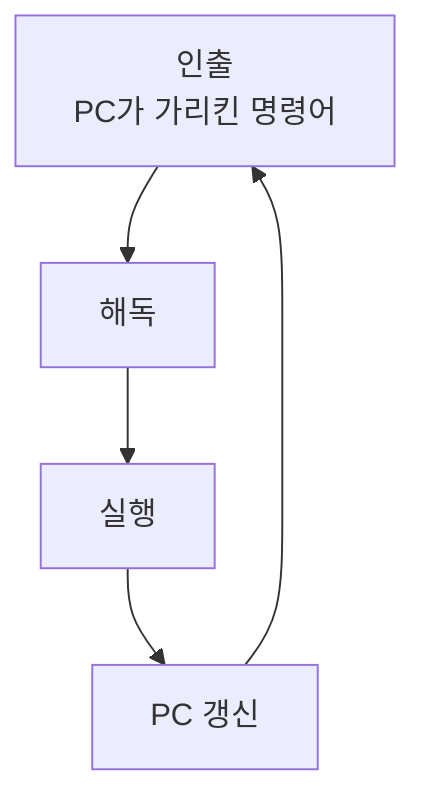

프로그램은 결국 명령어의 나열이고, CPU는 그걸 하나씩 가져와 실행합니다. 명령어 하나가 처리되는 한 사이클을 따라가 봅니다.

## CPU의 세 부품과 버스

CPU 안에는 셋이 있습니다.

- **ALU**: 계산기. 산술과 논리 연산을 담당.
- **제어장치**: 명령어를 해독해 제어 신호를 뿌림.
- **레지스터**: CPU 안의 초고속 임시 저장소. 다음 명령 주소를 든 PC, 현재 명령어를 든 IR 등.

CPU와 메모리는 버스로 이어집니다. 데이터 버스(무엇을), 주소 버스(어디서, 한 방향), 제어 버스(언제 어떻게)예요.

## 명령어 하나를 처리하는 네 단계

PC가 가리키는 주소에서 명령어를 가져와(인출) 해독하고 실행한 뒤, PC를 다음으로 옮깁니다. 분기 명령이면 PC를 대상 주소로 바꿔요. 이 사이클을 쉼 없이 반복합니다.

## 오퍼랜드를 가리키는 방식

명령어는 **연산코드**(무엇을 할지)와 **오퍼랜드**(대상)로 이뤄집니다. 대상을 가리키는 방식이 여럿이에요.

| 방식 | 대상 위치 | 메모리 접근 |
| --- | --- | --- |
| 즉시 | 명령어 안에 값이 직접 | 0회 |
| 레지스터 | 레지스터에 | 0회 |
| 직접 | 메모리 주소를 직접 지정 | 1회 |
| 간접 | 주소가 든 주소 | 2회 |

간접은 주소를 동적으로 바꿀 수 있어 유연하지만, 메모리를 두 번 타 느립니다.

## 인터럽트, 급한 일은 끼어든다

키보드 입력 같은 이벤트가 오면 CPU는 하던 일을 멈추고 현재 상태(레지스터와 PC)를 저장합니다. 그리고 인터럽트 벡터에서 처리 루틴(ISR)을 찾아 실행한 뒤 원래 자리로 돌아와요.

한 걸음 더인터럽트가 없다면 CPU는 "입력 왔나?"를 끊임없이 직접 확인(폴링)해야 해 자원을 낭비합니다. 인터럽트는 <b>일이 생겼을 때만 알려주는</b> 구조라, 그동안 CPU가 다른 일을 할 수 있게 해줍니다. 비동기 처리의 하드웨어 뿌리예요.

## 참고

- [말이 트이는 컴퓨터 구조 — 인프런](https://www.inflearn.com/courses/lecture?courseId=337646&unitId=313750)
- [중앙 처리 장치 — 위키백과](https://ko.wikipedia.org/wiki/중앙_처리_장치)
- [인터럽트 — 위키백과](https://ko.wikipedia.org/wiki/인터럽트)
