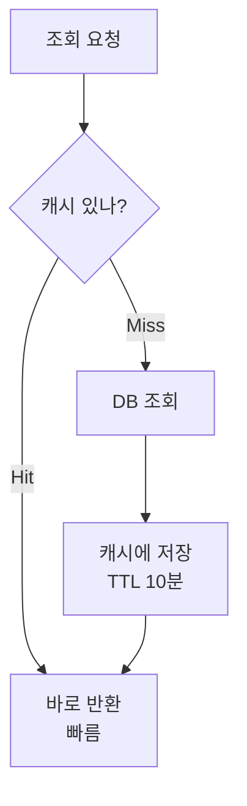

인기 상품, 브랜드 목록처럼 **자주 요청되지만 자주 바뀌지 않는** 데이터를 매번 DB에서 새로 조회하면, 응답도 느리고 DB 부하도 커집니다. 캐시는 이 지점을 노립니다.

## 캐시는 결국 트레이드오프

<div class="callout callout-tip"><span class="callout-label">한 줄 요약</span>캐시는 <b>정확도 ↔ 속도</b> 사이에서 균형을 선택하는 전략입니다. 항상 최신을 보장하지 않는다는 점을 전제로 깔고 써야 합니다.</div>

## TTL과 무효화 전략

| 전략 | 설명 | 예 |
| --- | --- | --- |
| TTL | 일정 시간 뒤 자동 만료 | 상품 상세 10분 |
| 수동 무효화 | 이벤트 발생 시 삭제 | 좋아요 시 캐시 삭제 |
| Write-Through | 쓰기 시 캐시도 갱신 | 포인트 충전 |
| Read-Through | 없으면 DB 조회 후 저장 | 기본 @Cacheable |
| Refresh-Ahead | 만료 전 미리 갱신 | 홈 화면, 랭킹 |

## 직접 제어가 흐름이 보인다

```java
public Product getProduct(Long id) {
    String key = "product:detail:" + id;
    Product cached = redis.opsForValue().get(key);
    if (cached != null) return cached;

    Product p = repository.findById(id)
        .orElseThrow(() -> new ProductNotFoundException(id));
    redis.opsForValue().set(key, p, Duration.ofMinutes(10));
    return p;
}
```

`@Cacheable` 은 간결하지만, 메서드 호출을 가로채는 **프록시(AOP)** 가 캐시를 대신 넣고 빼주기 때문에 _언제 어떻게_ 캐싱되는지가 코드에 안 드러납니다. 위처럼 직접 키와 TTL을 다루면 **언제 저장되고 언제 만료되는지** 가 눈에 보여, 복잡한 캐시 설계에서 유리합니다.



<div class="callout callout-q"><span class="callout-label">기억할 것</span>캐시 키는 도메인 속성 기준으로 구체적으로 짜고, 항상 <b>"캐시가 없으면?"</b> 시나리오를 함께 설계하세요. 중요한 비즈니스 데이터는 캐시보다 DB 정합성이 우선입니다.</div>

## 참고

- [Spring Caching 공식 문서](https://docs.spring.io/spring-boot/reference/io/caching.html)
- [Spring Data Redis — Baeldung](https://www.baeldung.com/spring-data-redis-tutorial)
- [Materialized View — AWS](https://aws.amazon.com/ko/what-is/materialized-view/)
