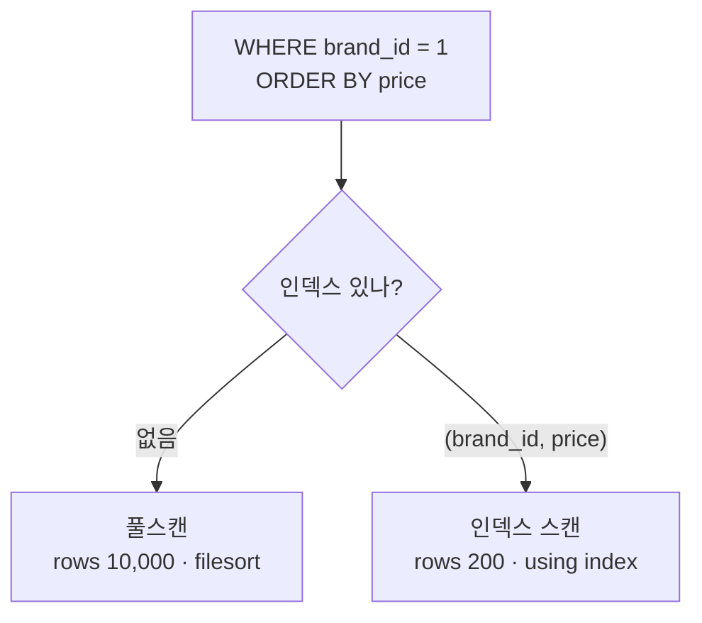

상품 목록을 `brand_id` 로 필터하고 `price` 로 정렬하는데 느리다면, 원인은 대개 **인덱스가 없거나, 있어도 안 쓰이는** 경우입니다. 인덱스가 왜 빠른지부터 짚어봅시다.

## 책갈피로 건너뛴다

인덱스는 대부분 **B-Tree** 기반입니다. 전체 테이블을 한 줄씩 훑는 대신, 정렬된 값의 _책갈피_ 를 따라 필요한 데이터로 바로 점프합니다.

<div class="callout callout-tip"><span class="callout-label">비유</span>서점에서 Java 책을 찾을 때 — 인덱스가 없으면 IT 코너의 모든 책을 확인해야 하고, 있으면 책의 위치를 바로 알아 곧장 집어옵니다.</div>



## 단일 vs 복합 인덱스

```sql
-- 단일: brand_id 필터는 빠르지만 정렬은 커버 못 함
CREATE INDEX idx_brand ON products(brand_id);

-- 복합: 필터 + 정렬까지 한 번에 커버
CREATE INDEX idx_brand_price ON products(brand_id, price);
```

복합 인덱스는 **왼쪽 → 오른쪽 순서** 로 조건을 쓸 때만 효과가 있습니다.

| 인덱스 | WHERE brand_id | ORDER BY price |
| --- | --- | --- |
| (brand_id) | 가능 | 불가 |
| (brand_id, price) | 가능 | 가능 |
| (price, brand_id) | 불가 | 불가 |

## EXPLAIN으로 확인

`EXPLAIN` 의 `Extra` 에 `Using filesort` 가 보이면 인덱스 정렬이 안 먹고 별도 정렬이 추가된 것, `Using index` 면 인덱스만으로 처리된 것입니다. `key` 가 null이면 인덱스 미사용이고요.

<div class="callout callout-q"><span class="callout-label">주의</span>자주 바뀌는 컬럼에 인덱스를 남발하면 <b>쓰기 성능</b>이 떨어집니다(행이 바뀔 때마다 인덱스도 같이 고쳐야 하니까요). 모수가 작을 땐 풀스캔이 오히려 빠를 수도 있어요. 그리고 인덱스는 <b>카디널리티</b>, 즉 <em>값의 다양성</em>(중복이 적을수록 높음 — 성별은 낮고 주민번호는 높음)이 큰 컬럼에 거는 게 기본입니다. 다양할수록 한 번에 후보를 확 좁혀 주니까요.</div>

## 참고

- [쿼리 튜닝과 인덱스 최적화 — WikiDocs](https://wikidocs.net/226253)
- [MySQL 방향별 인덱스 — 카카오 테크](https://tech.kakao.com/posts/351)
