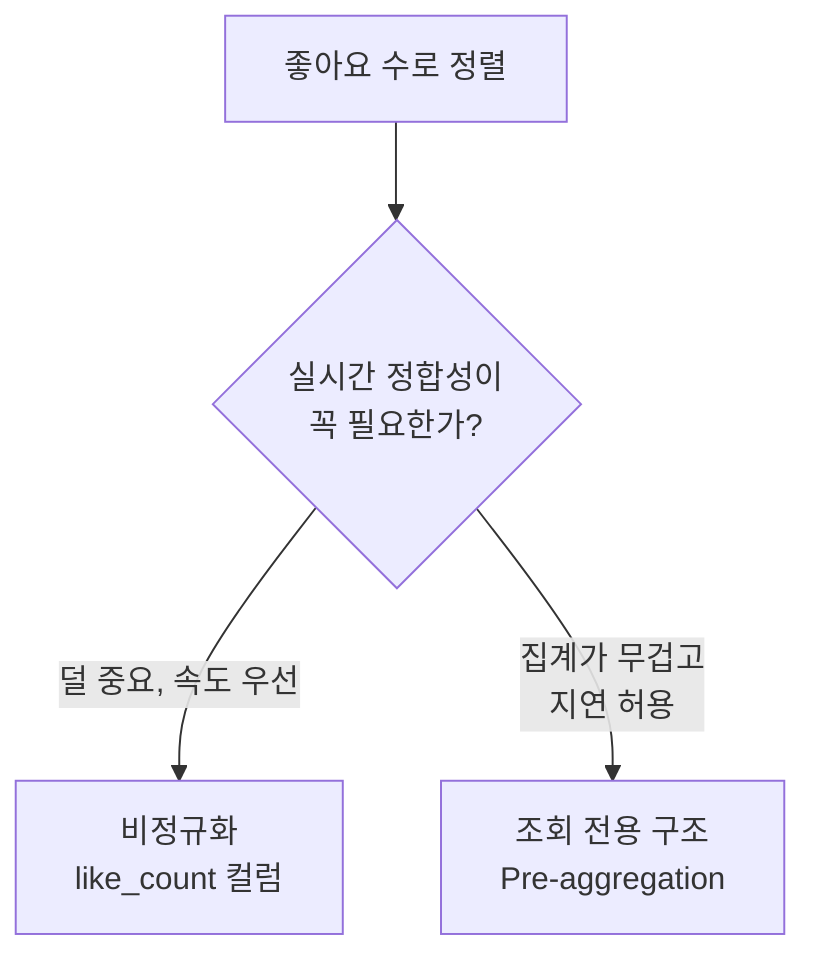

상품을 **좋아요 수 순으로** 정렬하려는데 느립니다. `like` 는 별도 테이블이고 `product` 에는 좋아요 수 컬럼이 없으니, 정렬하려면 매번 조인해서 세어야 하거든요. 인덱스로도 잘 안 풀리는 이 문제를 구조로 풉니다.

## 왜 조인 집계 정렬이 느릴까

좋아요는 보통 `(user_id, product_id)` 를 담는 별도 테이블입니다. 좋아요 수로 정렬하려면 상품마다 그 행을 세야 해요.

```sql
SELECT p.*, COUNT(l.id) AS like_count
FROM product p
LEFT JOIN likes l ON p.id = l.product_id
GROUP BY p.id
ORDER BY like_count DESC
LIMIT 20;
```

조인, `GROUP BY` 집계, 정렬이 _한 쿼리에_ 겹칩니다. 정렬 키(like_count)가 미리 계산된 값이 아니라 매 조회마다 만들어지는 값이라, 인덱스로 커버하기 어렵습니다. 상품이 늘수록 집계 비용과 정렬 비용이 같이 폭증해요. 애플리케이션에서 상품마다 count 쿼리를 따로 날리면 그건 **N+1**(상품 N건마다 추가 쿼리 1건)로 더 나빠집니다.

핵심은 하나입니다. **정렬 기준값을 조회 시점에 계산하지 말고, 미리 만들어 두자.**

## 대안 1, 비정규화 — like_count 컬럼을 둔다

`product` 에 좋아요 수를 직접 들고, 좋아요 등록/취소 때 같이 갱신합니다.

```sql
ALTER TABLE product ADD COLUMN like_count INT DEFAULT 0;
-- 정렬이 단순 컬럼 정렬로 바뀜 → 인덱스 사용 가능
SELECT * FROM product ORDER BY like_count DESC LIMIT 20;
```

조회는 매우 빨라지고 `like_count` 에 인덱스도 걸 수 있어요. 대신 _쓰기_ 가 까다로워집니다. 좋아요와 카운트를 함께 갱신해야 하니 동시성과 정합성을 챙겨야 해요. 동시에 누른 두 요청이 서로의 증가를 덮어쓰면(lost update) 수가 틀어지므로, 원자적 증감이나 락이 필요합니다.

```sql
-- 읽고 더해 쓰는 대신, DB에서 원자적으로 증가
UPDATE product SET like_count = like_count + 1 WHERE id = ?;
```

## 대안 2, 조회 전용 구조로 분리한다

정렬용 집계를 아예 별도 테이블이나 View로 빼서, 주기적으로 또는 이벤트로 채웁니다.

```sql
CREATE TABLE product_like_view (
  product_id BIGINT PRIMARY KEY,
  like_count INT
);
```

원본 `product` 는 그대로 두고 조회/튜닝을 이 테이블에서만 합니다. 실시간성은 조금 희생되지만(채우는 주기만큼 지연), 정렬과 인덱싱이 깔끔해져요. 이렇게 **미리 계산해 저장해 두는 것** 을 Pre-aggregation이라 하고, 좋아요 수, 랭킹, 카테고리별 상품 수처럼 매번 실시간 계산이 부담스러운 값에 씁니다. Materialized View, 배치 적재, 이벤트 기반 적재(Kafka, 스케줄러)가 대표적 구현입니다.

## 무엇을 고를까



| 항목 | 정규화 유지 (조인 집계) | 비정규화 (like_count) |
| --- | --- | --- |
| 조회 성능 | 느림 | 빠름 |
| 쓰기 복잡도 | 단순 | 증가 |
| 실시간성 | 완전 보장 | 약간 지연 가능 |
| 확장성 | 유연 | 단순 정렬만 |

<div class="callout callout-q"><span class="callout-label">한 걸음 더</span>정렬 기준으로 쓰는 값은 <b>조회 전용 구조나 비정규화 필드</b>로 따로 유지하는 경우가 많습니다. 단, 비정규화는 공짜가 아니에요 — 원본과 사본 두 곳을 맞춰야 하므로 <em>갱신 경로</em>를 하나로 모으고, 어긋났을 때 다시 맞추는(재집계) 방법을 처음부터 정해 두세요. 실시간 정합성이 돈이나 재고처럼 중요한 데이터에는 속도보다 DB 정합성이 우선입니다.</div>

## 참고

- [쿼리 튜닝과 인덱스 최적화 — WikiDocs](https://wikidocs.net/226253)
- [Materialized View란 — AWS](https://aws.amazon.com/ko/what-is/materialized-view/)
- [REDIS 캐시 설계 전략 지침 — Inpa Dev](https://inpa.tistory.com/entry/REDIS-%F0%9F%93%9A-%EC%BA%90%EC%8B%9CCache-%EC%84%A4%EA%B3%84-%EC%A0%84%EB%9E%B5-%EC%A7%80%EC%B9%A8-%EC%B4%9D%EC%A0%95%EB%A6%AC)
