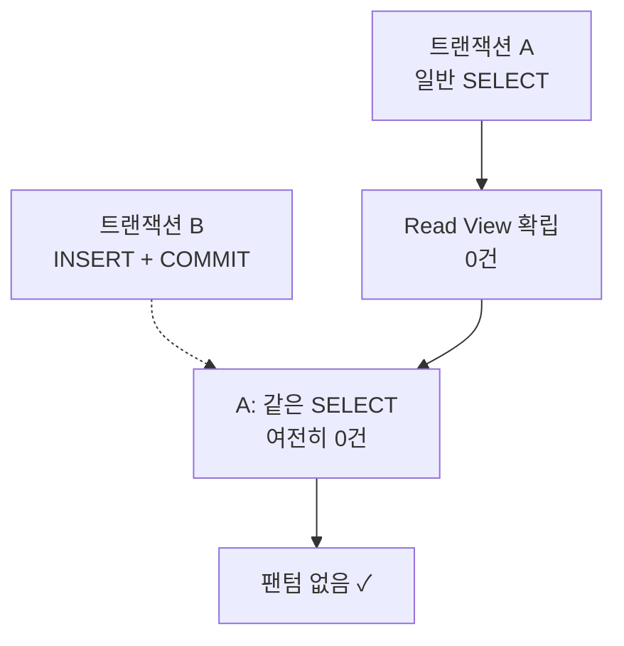
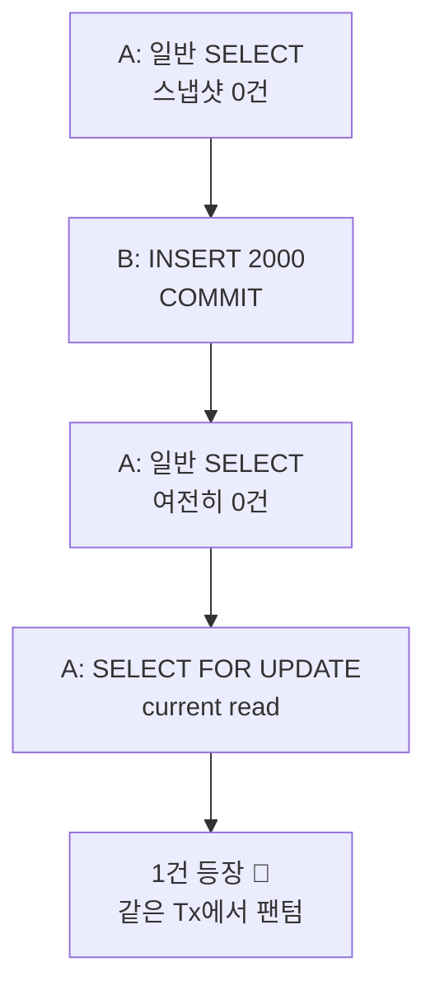

교과서대로면 **REPEATABLE READ** 는 팬텀 리드를 _허용_ 합니다. 그런데 MySQL InnoDB에서 똑같은 조회를 두 번 날려보면, 중간에 다른 트랜잭션이 행을 끼워 넣어도 새 행이 보이지 않아요. 표준을 어긴 걸까요? 아닙니다. InnoDB가 한 수 더 둔 겁니다.

## 스냅샷을 읽기 때문이다

InnoDB의 일반 `SELECT` 는 실제 테이블이 아니라 **MVCC 스냅샷** 을 읽습니다. 트랜잭션이 첫 일관된 읽기를 하는 순간 _Read View_ 가 만들어지고, 그 시점에 커밋돼 있던 버전만 보입니다. 이후 다른 트랜잭션이 INSERT/COMMIT 해도 내 Read View는 그대로라, 새 행은 **존재하지만 보이지 않습니다.**

옛 버전은 **undo log** 에 남아 있어, 내 스냅샷 시점의 모습을 그대로 재구성해줍니다. 그래서 같은 쿼리는 트랜잭션 내내 같은 결과 — 팬텀이 끼어들 틈이 없죠.



## 그럼 팬텀은 영영 안 생기나?

여기서 한 꺼풀 더 들어갑니다. 스냅샷을 읽는 건 **일반(non-locking) SELECT** 일 때 이야기예요. **잠금 읽기** 는 규칙이 다릅니다.

<div class="callout callout-tip"><span class="callout-label">KEY POINT</span><code>SELECT … FOR UPDATE</code> 는 스냅샷이 아니라 <b>현재(current) 데이터</b>를 읽습니다. 락은 과거 버전이 아니라 <em>실제 최신 행</em>에 걸어야 의미가 있으니까요.</div>

## FOR UPDATE는 스냅샷을 건너뛴다

잠금 읽기는 최신 커밋된 데이터를 직접 봅니다. 그래서 **일반 읽기로 스냅샷을 먼저 잡아둔 뒤**, 같은 트랜잭션에서 `FOR UPDATE` 를 날리면 — 스냅샷엔 없던 행이 튀어나옵니다. 한 트랜잭션 안에서 팬텀이 실제로 등장하는 순간이죠.

```sql
-- 세션 A
START TRANSACTION;
SELECT * FROM orders WHERE price > 1000;

-- 세션 B (그 사이)
INSERT INTO orders(price) VALUES (2000);
COMMIT;

-- 세션 A, 같은 트랜잭션
SELECT * FROM orders WHERE price > 1000;
-- 0건 (스냅샷 그대로)
SELECT * FROM orders WHERE price > 1000 FOR UPDATE;
-- 1건! 팬텀
```



## 왜 이렇게 동작할까

락은 _지금 존재하는 실제 행_ 에 걸어야 다른 트랜잭션의 수정을 막을 수 있습니다. undo log로 재구성한 과거 버전엔 잠글 대상이 없죠. 그래서 잠금 읽기·UPDATE·DELETE는 스냅샷을 무시하고 **최신 커밋본을 다시 읽습니다(current read).**

| 읽기 종류 | 읽는 대상 | 팬텀 |
| --- | --- | --- |
| 일반 SELECT | MVCC 스냅샷 | 안 보임 |
| SELECT … FOR UPDATE | 현재 최신 데이터 | 보일 수 있음 |
| UPDATE / DELETE | 현재 최신 데이터 | 보일 수 있음 |

<div class="callout callout-q"><span class="callout-label">한 걸음 더</span>그럼 InnoDB는 잠금 읽기의 팬텀을 못 막나? — <b>Next-Key Lock</b>(레코드 락 + 갭 락)으로 막습니다. 단, <em>처음부터</em> 잠금 읽기로 범위를 잠갔을 때 얘기예요. 위 예시는 일반 읽기로 갭을 안 잠근 채 세션 B가 끼어들 수 있었기 때문에 팬텀이 난 겁니다.</div>

정리하면 — InnoDB의 RR이 팬텀을 막는 건 **MVCC 스냅샷** 덕분이고, 그 보호는 **일반 읽기에 한정** 됩니다. `FOR UPDATE` 처럼 현재 데이터를 읽는 순간 스냅샷 밖으로 나가고, 팬텀이 보일 수 있습니다.
