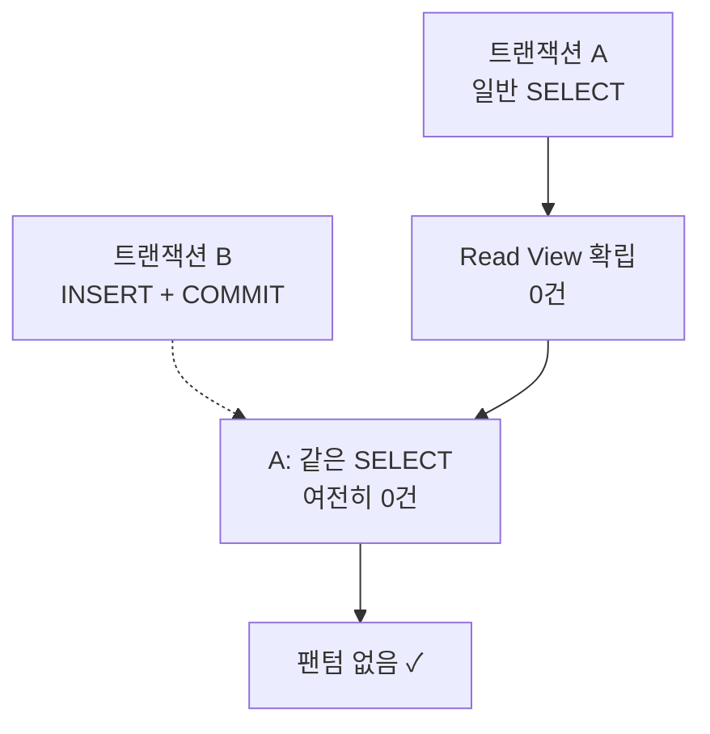
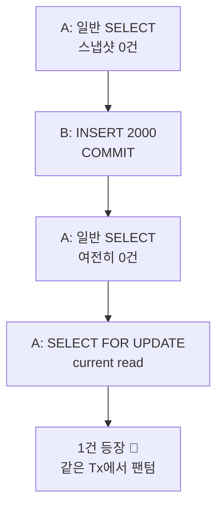

교과서대로면 **REPEATABLE READ** 는 팬텀 리드를 _허용_ 합니다. 그런데 MySQL InnoDB에서 똑같은 조회를 두 번 날려보면, 중간에 다른 트랜잭션이 행을 끼워 넣어도 새 행이 보이지 않아요. 표준을 어긴 걸까요? 아닙니다. InnoDB가 한 수 더 둔 겁니다. 그 이유를 격리 수준부터 차근차근 풀어봅니다.

## 먼저, 격리 수준 4단계

트랜잭션의 **격리성(Isolation)** 은 동시에 도는 트랜잭션들이 서로 얼마나 간섭하지 못하게 막느냐의 단계입니다. 단계가 높아질수록 안전하지만 동시성은 떨어지죠. 각 단계가 막아주는 _이상 현상_ 은 셋입니다.

- **Dirty Read** — 다른 트랜잭션이 _아직 커밋하지 않은_ 데이터를 읽는 것
- **Non-repeatable Read** — 같은 행을 두 번 읽었는데 _값이 바뀌어_ 있는 것
- **Phantom Read** — 같은 조건으로 두 번 조회했는데 _없던 행이 새로_ 나타나는 것 (예: `WHERE price > 10000`)

| 격리 수준 | Dirty | Non-repeatable | Phantom |
| --- | --- | --- | --- |
| READ UNCOMMITTED | 발생 | 발생 | 발생 |
| READ COMMITTED | 방지 | 발생 | 발생 |
| REPEATABLE READ | 방지 | 방지 | 발생 _(InnoDB는 방지)_ |
| SERIALIZABLE | 방지 | 방지 | 방지 |

표의 마지막 칸이 오늘의 주인공입니다. 표준상 RR은 팬텀을 허용하는데, **InnoDB만 유독 막아줍니다.** 어떻게?

## 스냅샷을 읽기 때문이다

InnoDB의 일반 `SELECT` 는 실제 테이블이 아니라 **MVCC 스냅샷** 을 읽습니다. 트랜잭션이 첫 일관된 읽기를 하는 순간 _Read View_ 가 만들어지고, 그 시점에 커밋돼 있던 버전만 보입니다. 이후 다른 트랜잭션이 INSERT/COMMIT 해도 내 Read View는 그대로라, 새 행은 **존재하지만 보이지 않습니다.**

옛 버전은 **undo log** 에 남아 있어, 내 스냅샷 시점의 모습을 그대로 재구성해줍니다. 그래서 같은 쿼리는 트랜잭션 내내 같은 결과 — 팬텀이 끼어들 틈이 없죠.



## 그럼 팬텀은 영영 안 생기나?

여기서 한 꺼풀 더 들어갑니다. 스냅샷을 읽는 건 **일반(non-locking) SELECT** 일 때 이야기예요. **잠금 읽기** 는 규칙이 다릅니다.

<div class="callout callout-tip"><span class="callout-label">KEY POINT</span><code>SELECT … FOR UPDATE</code> 는 스냅샷이 아니라 <b>현재(current) 데이터</b>를 읽습니다. 락은 과거 버전이 아니라 <em>실제 최신 행</em>에 걸어야 의미가 있으니까요.</div>

## FOR UPDATE는 스냅샷을 건너뛴다

잠금 읽기는 최신 커밋된 데이터를 직접 봅니다. 그래서 **일반 읽기로 스냅샷을 먼저 잡아둔 뒤**, 같은 트랜잭션에서 `FOR UPDATE` 를 날리면 — 스냅샷엔 없던 행이 튀어나옵니다. 한 트랜잭션 안에서 팬텀이 실제로 등장하는 순간이죠.

```sql
-- 세션 A
START TRANSACTION;
SELECT * FROM orders WHERE price > 1000;

-- 세션 B (그 사이)
INSERT INTO orders(price) VALUES (2000);
COMMIT;

-- 세션 A, 같은 트랜잭션
SELECT * FROM orders WHERE price > 1000;
-- 0건 (스냅샷 그대로)
SELECT * FROM orders WHERE price > 1000 FOR UPDATE;
-- 1건! 팬텀
```



## 왜 이렇게 동작할까

락은 _지금 존재하는 실제 행_ 에 걸어야 다른 트랜잭션의 수정을 막을 수 있습니다. undo log로 재구성한 과거 버전엔 잠글 대상이 없죠. 그래서 잠금 읽기·UPDATE·DELETE는 스냅샷을 무시하고 **최신 커밋본을 다시 읽습니다(current read).**

| 읽기 종류 | 읽는 대상 | 팬텀 |
| --- | --- | --- |
| 일반 SELECT | MVCC 스냅샷 | 안 보임 |
| SELECT … FOR UPDATE | 현재 최신 데이터 | 보일 수 있음 |
| UPDATE / DELETE | 현재 최신 데이터 | 보일 수 있음 |

<div class="callout callout-q"><span class="callout-label">한 걸음 더</span>그럼 InnoDB는 잠금 읽기의 팬텀을 못 막나? — <b>Next-Key Lock</b>으로 막습니다. 존재하는 행만 잠그는 게 아니라, <b>행과 행 사이의 빈 구간(gap)까지 잠가</b> 그 범위에 누가 새 행을 <code>INSERT</code> 하지 못하게 막는 거예요. 그러면 없던 행이 생길 수 없으니 팬텀도 없죠. 단, 이건 <em>처음부터</em> 잠금 읽기로 범위를 잠갔을 때 얘기입니다. 위 예시는 일반 읽기라 빈 구간을 안 잠갔고, 그 틈에 세션 B가 끼어들 수 있었기 때문에 팬텀이 난 겁니다.</div>

## 실무에선 — 락 전략으로 막는다

팬텀을 만든 그 `FOR UPDATE` 가 사실은 **비관적 락** 의 도구입니다. 정합성이 중요한 흐름(재고·좌석·포인트)에선 _처음부터_ 의도적으로 락을 걸어, 다른 트랜잭션이 끼어들 틈(갭)을 없앱니다. JPA는 두 가지 전략을 줍니다.

**😠 비관적 락** — 읽는 순간 DB에 락을 걸어 남이 못 건드리게 선점합니다. `SELECT … FOR UPDATE` 가 이것이고, JPA에선 `@Lock(PESSIMISTIC_WRITE)`. 안정적이지만 대기·데드락·성능 비용이 있습니다.

```java
@Lock(LockModeType.PESSIMISTIC_WRITE)
@Query("SELECT s FROM Stock s WHERE s.id = :id")
Stock findByIdForUpdate(@Param("id") Long id);
```

**🙂 낙관적 락** — 락을 걸지 않고, 커밋 시점에 버전(`@Version`)을 비교해 충돌을 감지합니다. 충돌하면 `OptimisticLockingFailureException` 으로 한 명만 성공시키고 나머지는 실패·재시도합니다.

```java
@Entity
class Stock {
    @Id Long id;
    int quantity;
    @Version Long version;
}
```

| 전략 | 장점 | 단점 | 적합한 상황 |
| --- | --- | --- | --- |
| 비관적 락 | 정합성 보장 | 데드락·성능 저하 | 충돌 잦고 꼭 지켜야 할 자원 |
| 낙관적 락 | 락 없이 빠름 | 충돌 시 예외 처리 | 충돌 드물고 한 명만 성공시키면 될 때 |

<div class="callout callout-tip"><span class="callout-label">정리</span>InnoDB의 RR이 팬텀을 막는 건 <b>MVCC 스냅샷</b> 덕분이고, 그 보호는 <b>일반 읽기에 한정</b>됩니다. <code>FOR UPDATE</code>처럼 현재 데이터를 읽는 순간 스냅샷 밖으로 나가 팬텀이 보일 수 있어요. 그래서 정합성이 절대적인 흐름은 <em>스냅샷에 기대지 말고</em> 비관적·낙관적 락으로 명시적으로 지킵니다.</div>

## 참고

- [MySQL 트랜잭션 격리 수준 공식 문서](https://dev.mysql.com/doc/refman/8.0/en/innodb-transaction-isolation-levels.html)
- [JPA 트랜잭션 전파와 격리 — Baeldung](https://www.baeldung.com/spring-transactional-propagation-isolation)
- [JPA 낙관적 락 — Baeldung](https://www.baeldung.com/jpa-optimistic-locking)
- [JPA 더티 체킹 — 기억보단 기록을](https://jojoldu.tistory.com/415)
