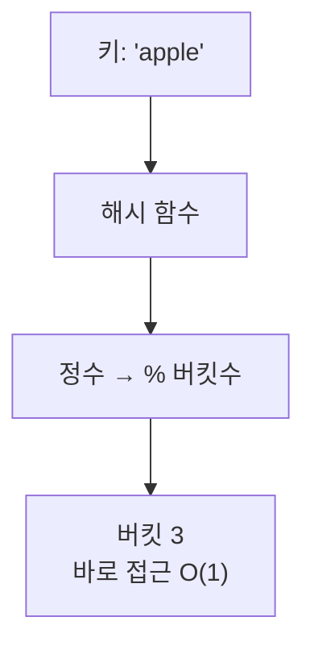

해시 테이블은 평균 **O(1)** 으로 값을 찾습니다. 배열은 인덱스를 알아야 빠른데, 해시 테이블은 _키_ 만 알면 인덱스를 계산해냅니다. 그 계산이 해시 함수예요.

## 키를 주소로 바꾼다

해시 함수가 키를 정수로 바꾸고, 배열 크기로 나눈 나머지가 저장 위치(버킷)가 됩니다. 찾을 때도 같은 계산을 하니, 어디 있는지 _뒤지지 않고_ 바로 갑니다.

## 충돌은 어쩌나

서로 다른 키가 같은 버킷으로 가는 **충돌** 은 피할 수 없습니다. 대표적 해결법 두 가지:

| 방법 | 설명 |
| --- | --- |
| 체이닝 | 버킷마다 연결 리스트로 묶음 |
| 개방 주소법 | 빈 버킷을 찾아 옆으로 이동 |

O(1)의 조건충돌이 몰리면 한 버킷이 길어져 최악 <b>O(n)</b>이 됩니다. 그래서 적재율(load factor)이 일정 이상이면 배열을 키우고 다시 배치하는 <b>리해싱</b>으로 평균 O(1)을 유지합니다.

