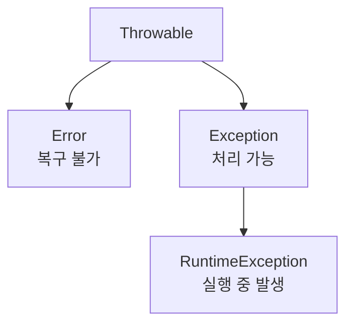

면접 단골 셋을 한 번에 정리합니다. 예외 계층, `==` 와 `equals`, 그리고 String 삼형제.

## 예외는 Error와 Exception으로 갈린다

**Error** 는 메모리 부족 같은 시스템 문제라 복구가 안 돼 catch하지 않습니다. **Exception** 은 개발자가 처리할 수 있고, 그 아래 **RuntimeException**(NullPointerException 등)이 있어요.

## Checked vs Unchecked

- **Checked**(IOException 등): 컴파일러가 `try-catch` 나 `throws` 를 강제합니다. 파일, 네트워크 같은 외부 자원을 다룰 때예요.
- **Unchecked**(RuntimeException 계열): 강제하지 않습니다. 대부분 개발자 실수라, `try-catch` 남발보다 사전 검증으로 예방하는 게 맞아요.

## == 는 주소, equals 는 값

`==` 는 참조형에서 _주소_ 를 비교합니다. `new String("hi")` 두 개는 내용이 같아도 주소가 달라, `==` 면 false, `equals` 면 true예요.

여기서 철칙 하나. **equals를 재정의하면 hashCode도 함께** 재정의해야 합니다. HashMap과 HashSet은 hashCode로 버킷을 찾고 equals로 최종 비교하거든요. 둘을 안 맞추면 같은 값인데 다른 키로 취급돼 버립니다.

## String, StringBuilder, StringBuffer

- **String**: 불변. 바꾸면 새 객체가 생겨 반복 연결에 비효율
- **StringBuilder**: 가변, 동기화 없음 → 단일 스레드에서 가장 빠름
- **StringBuffer**: 가변, synchronized → 멀티스레드 안전하지만 느림

한 걸음 더문자열을 루프로 <code>+=</code> 하면 매번 새 String이 생겨 GC 부담이 커집니다. 반복 연결엔 StringBuilder를 쓰세요. 그리고 값으로 비교할 객체는 <b>equals와 hashCode를 짝으로</b> 재정의하는 게 기본입니다 — 하나만 바꾸면 컬렉션에서 미묘한 버그가 납니다.

## 참고

- [말이 트이는 자바와 객체지향 — 인프런](https://www.inflearn.com/courses/lecture?courseId=338480&unitId=336170)
- [Java equals() and hashCode() Contracts — Baeldung](https://www.baeldung.com/java-equals-hashcode-contracts)
