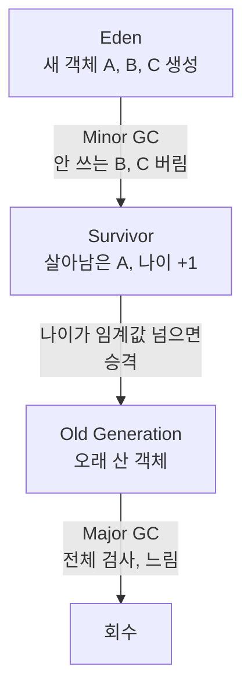

C는 `malloc` 으로 빌린 메모리를 `free` 로 직접 반납합니다. 자바는 안 쓰는 객체를 **가비지 컬렉터**(GC)가 알아서 치워요. 무엇을, 언제, 어떻게 치우는지 봅니다.

## 도달할 수 없으면 쓰레기다

GC는 **Heap만** 봅니다(Stack은 메서드가 끝나면 자동 해제라 대상이 아니에요). GC Root(스택의 지역변수, static 변수 등)에서 참조를 타고 닿을 수 있는 객체는 살리고, 어디서도 닿지 않는(unreachable) 객체만 회수합니다.

## Mark, Sweep, 그리고 Compaction

- **Stop-the-World**: 모든 앱 스레드를 잠깐 멈춤
- **Mark**: 살아있는 객체를 표시
- **Sweep**: 표시 안 된 것을 제거
- **Compaction**: 남은 객체를 한쪽으로 모아 단편화 방지

## 세대로 나눠 자주 비운다

대부분의 객체는 만들자마자 곧 안 쓰입니다(약한 세대 가설). 그래서 Heap을 Young과 Old로 나눠요.

Young을 자주 빠르게 비우는 **Minor GC**, Old 전체를 훑는 무거운 **Major GC**로 나뉩니다. 곧 죽을 객체를 싼 비용으로 처리하려는 설계예요.

## GC 알고리즘은 멈춤과의 싸움

Serial, Parallel, CMS, G1, ZGC로 이어지는 흐름은 결국 Stop-the-World 시간을 줄이는 방향입니다. G1은 힙을 영역으로 쪼개 우선순위로 수집하고, ZGC는 멈춤을 수 밀리초로 낮춰요.

한 걸음 더GC는 편하지만 공짜가 아닙니다. Stop-the-World 동안 앱이 멈춰 응답 지연이 튀어요(꼬리 지연 p99의 흔한 범인). 객체를 마구 만들면 GC가 자주 돌아 처리량이 깎이니, 트래픽이 큰 서버는 불필요한 객체 생성을 줄이고 <b>GC 로그</b>를 들여다봅니다.

## 참고

- [말이 트이는 자바와 객체지향 — 인프런](https://www.inflearn.com/courses/lecture?courseId=338480&unitId=336153)
- [JVM Garbage Collectors — Baeldung](https://www.baeldung.com/jvm-garbage-collectors)
