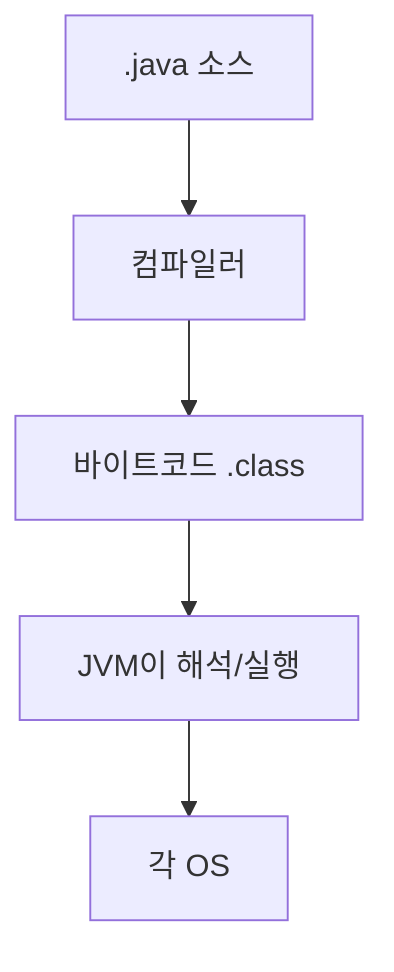

자바는 "한 번 작성하면 어디서나 돈다"(Write Once, Run Anywhere)고 합니다. 윈도우에서 짠 코드가 리눅스에서 그대로 도는 비결은 **JVM**(자바 가상 머신), 컴퓨터 안의 또 하나의 가상 컴퓨터예요.

## 바이트코드라는 중간 언어

자바 코드는 기계어로 바로 가지 않습니다.

핵심은 바이트코드라는 중간 단계입니다. OS마다 다른 JVM이 깔려 있어, 같은 바이트코드를 각자의 JVM이 알아서 돌려요. OS 차이를 JVM이 흡수하는 겁니다.

## JVM의 네 부품

- **클래스 로더**: 바이트코드를 메모리에 적재(로딩 → 링크 → 초기화)
- **런타임 데이터 영역**: 실행 중 데이터를 보관
- **실행 엔진**: 바이트코드를 실제 실행
- **가비지 컬렉터**: 안 쓰는 객체를 회수

## 메모리는 영역별로 나뉜다

- **Heap**: `new` 로 만든 객체. GC 대상. 모든 스레드가 공유.
- **Stack**: 메서드 호출 프레임(지역변수, 매개변수). 스레드마다 따로.
- **Method Area**: 클래스 정보와 static 변수.
- **PC Register, Native Method Stack**: 현재 명령어 위치 등.

Stack과 PC Register가 스레드마다 따로 생기는데, 이건 사이트의 "스레드와 프로세스" 글에서 본 "스레드는 스택만 독립"과 정확히 맞물립니다.

## 인터프리터와 JIT를 함께 쓴다

실행 엔진은 처음엔 **인터프리터** 로 한 줄씩 돌려 시작이 빠릅니다. 그러다 자주 반복되는 코드(핫스팟)는 **JIT 컴파일러** 가 기계어로 바꿔 캐싱해, 반복 실행이 빨라져요. 둘을 섞어 시작도 반복도 빠르게 가져갑니다.

한 걸음 더플랫폼 독립에는 대가가 있습니다. 바이트코드를 한 번 더 거치니 순수 네이티브(C)보다 <b>시동이 느려요</b>. JIT가 그 격차를 메우지만 달궈지는(warm-up) 시간이 필요합니다. 그래서 짧게 끝나는 CLI엔 불리하고, 오래 도는 서버엔 이득입니다.

## 참고

- [말이 트이는 자바와 객체지향 — 인프런](https://www.inflearn.com/courses/lecture?courseId=338480&unitId=336152)
- [자바 가상 머신 — 위키백과](https://ko.wikipedia.org/wiki/자바_가상_머신)
