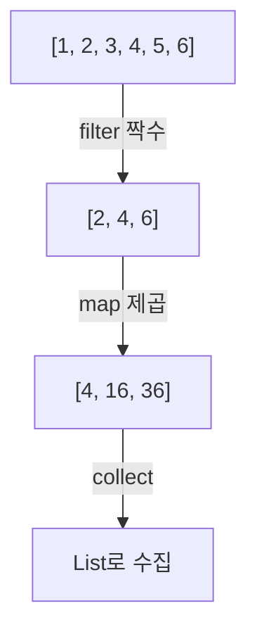

자바 8이 함수형 프로그래밍을 들여왔습니다. 람다와 Stream으로 "어떻게"가 아니라 "무엇을"을 적게 됐어요.

## 함수형 인터페이스와 람다

추상 메서드가 _딱 하나_ 인 인터페이스가 함수형 인터페이스입니다(`@FunctionalInterface`). 그걸 람다로 간결하게 구현해요. 예전엔 클래스를 만들고 메서드를 구현해야 했던 걸 한 줄로 줄입니다.

```java
// 두 정수의 합
(a, b) -> a + b
```

## Stream은 내부 반복이다

컬렉션은 `for` 로 _직접 돌리는_ 외부 반복이고, Stream은 "무엇을 할지"만 선언하면 _내부가 돌려주는_ 내부 반복입니다.

```java
list.stream()
    .filter(n -> n % 2 == 0)
    .map(n -> n * n)
    .collect(toList());
```



## 중간 연산은 미뤄진다

`filter` 와 `map` 같은 중간 연산은 쌓아두기만 하고, `collect` 같은 최종 연산이 올 때 한 번에 흐릅니다(지연 평가). 요소 하나가 filter를 통과하면 곧장 map으로 넘어가는 식이라, 불필요한 연산을 줄여요.

## 병렬은 공짜가 아니다

`parallelStream()` 으로 여러 스레드에 나눠 처리할 수 있지만, 데이터가 적으면 나누는 비용이 더 커 손해고 결과 순서도 흐트러질 수 있습니다.

<div class="callout callout-q"><span class="callout-label">한 걸음 더</span>Stream은 짧고 선언적이라 읽기 좋지만, 디버깅이 까다롭고 단순 루프보다 느릴 때도 있습니다. <b>데이터 변환 파이프라인</b>엔 Stream이 빛나고, 부수효과(side effect)가 많은 로직엔 평범한 for문이 더 정직해요. 도구를 상황에 맞게 고르세요.</div>

## 참고

- [말이 트이는 자바와 객체지향 — 인프런](https://www.inflearn.com/courses/lecture?courseId=338480&unitId=336174)
- [Java 8 Streams — Baeldung](https://www.baeldung.com/java-8-streams)
