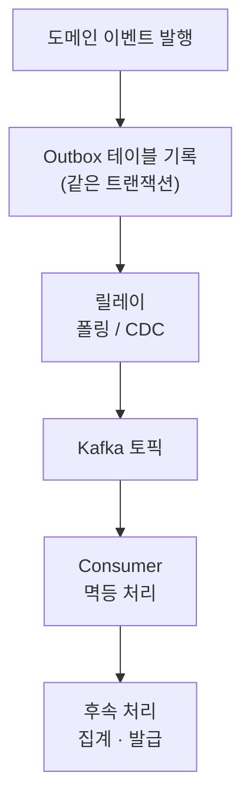

재고 차감·쿠폰 사용·결제·주문 저장을 **한 트랜잭션**에 묶으면, PG 장애 하나에 주문 전체가 롤백되고, 결합도는 높아지고, DB 락을 오래 쥐어 TPS가 떨어집니다. 이벤트는 이 무거운 트랜잭션을 쪼개는 도구예요.

## 지금 할 일 vs 나중에 할 일

먼저 둘을 가릅니다. _지금 꼭_ 해야 하는 것(주문 생성·금액 계산·검증 → 반드시 커밋)과 _나중에 해도_ 되는 것(쿠폰 차감·포인트 적립·PG 호출 → 커밋 이후). **PG가 죽어도 주문은 저장돼야 한다** 는 게 분리의 이유입니다.

## Command vs Event

- **Command** — "~을 해라" (요청, 호출자가 흐름을 제어)
- **Event** — "~이 발생했다" (사실 통지, 후속 핸들러가 알아서 반응)

이벤트를 쓰면 발행자가 후속 처리를 _모르게_ 되어 결합이 끊깁니다.

## ApplicationEvent와 AFTER_COMMIT

Kafka 같은 브로커 없이도, Spring `ApplicationEventPublisher` 로 단일 JVM 안에서 후속 흐름을 분리할 수 있습니다.

```java
@Transactional
void createOrder(...) {
    Order o = repo.save(...);
    publisher.publishEvent(OrderCreatedEvent.from(o));
}

@TransactionalEventListener(phase = AFTER_COMMIT)
@Async
void handle(OrderCreatedEvent e) {
    pointService.record(e.amount());
    pgClient.pay(PaymentCommand.from(e));
}
```

<div class="callout callout-tip"><span class="callout-label">KEY POINT</span><code>AFTER_COMMIT</code>이 핵심입니다. 트랜잭션이 <b>성공 커밋된 뒤에만</b> 리스너가 동작하므로, 롤백된 주문에 쿠폰을 차감하는 정합성 사고를 원천 차단합니다.</div>

## 이벤트는 은탄환이 아니다

`@Async`·이벤트는 제어 흐름이 안 보이고 실패 감지가 어렵습니다. 예외 은닉(→ 모니터링), 순서 보장 어려움(→ 순서 의존 없는 흐름만 분리), 중복 실행(→ `eventId` 멱등 처리), 장애 누락(→ DLQ)을 함께 설계해야 해요. 그래서 _진짜 중요한_ 처리는 Kafka로 보냅니다.

## Kafka — 분산 로그 저장소

흔히 고성능 큐로 알지만, 근본은 디스크에 로그를 append하는 **분산 로그 저장소**입니다. Consumer가 각자 Offset을 기억해 원하는 시점부터 다시 읽을 수 있어 재처리가 가능하고, 순서는 **Partition 단위로만** 보장됩니다.

| 구분 | ApplicationEvent | Kafka |
| --- | --- | --- |
| 범위 | 앱 내부(단일 JVM) | 서비스·시스템 간 |
| 보존 | 없음(메모리) | 로그로 보존 |
| 신뢰성 | 장애 시 손실 | 저장·재처리(at-least-once) |
| 용도 | 내부 후속 처리 | 전달·데이터 파이프라인 |

신뢰성은 **Producer는 At Least Once + Consumer는 멱등 처리**로 맞춥니다. Producer 측은 **Transactional Outbox**(DB write와 메시지 기록을 한 트랜잭션으로 묶고 릴레이가 Kafka로 전달), Consumer 측은 처리한 메시지 ID를 기록해 중복을 skip합니다.



## 참고

- [Event와 Command의 차이 — littlemobs](https://littlemobs.com/blog/difference-between-event-and-command/)
- [LINE에서 Kafka를 사용하는 방법 — LINE Engineering](https://engineering.linecorp.com/ko/blog/how-to-use-kafka-in-line-1)
- [Transactional Outbox — microservices.io](https://microservices.io/patterns/data/transactional-outbox.html)
- [Spring Events — Baeldung](https://www.baeldung.com/spring-events)
- [Apache Kafka 공식 문서](https://kafka.apache.org/documentation/)
