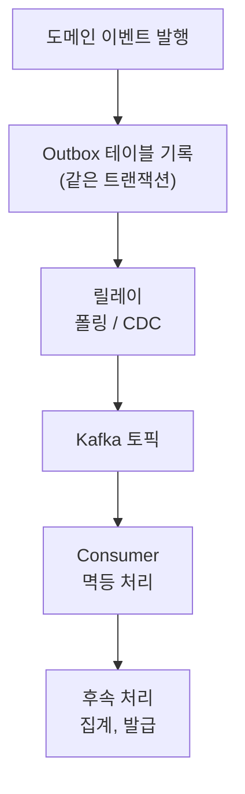

재고 차감, 쿠폰 사용, 결제, 주문 저장을 **한 트랜잭션**에 묶으면, PG 장애 하나에 주문 전체가 롤백되고, 결합도는 높아지고, DB 락을 오래 쥐어 TPS가 떨어집니다. 이벤트는 이 무거운 트랜잭션을 쪼개는 도구예요.

## 지금 할 일 vs 나중에 할 일

먼저 둘을 가릅니다. _지금 꼭_ 해야 하는 것(주문 생성, 금액 계산, 검증 → 반드시 커밋)과 _나중에 해도_ 되는 것(쿠폰 차감, 포인트 적립, PG 호출 → 커밋 이후). **PG가 죽어도 주문은 저장돼야 한다** 는 게 분리의 이유입니다.

## Command vs Event

- **Command** — "~을 해라" (요청, 호출자가 흐름을 제어)
- **Event** — "~이 발생했다" (사실 통지, 후속 핸들러가 알아서 반응)

이벤트를 쓰면 발행자가 후속 처리를 _모르게_ 되어 결합이 끊깁니다.

## ApplicationEvent와 AFTER_COMMIT

Kafka 같은 브로커 없이도, Spring `ApplicationEventPublisher` 로 단일 JVM 안에서 후속 흐름을 분리할 수 있습니다.

```java
@Transactional
void createOrder(...) {
    Order o = repo.save(...);
    publisher.publishEvent(OrderCreatedEvent.from(o));
}

@TransactionalEventListener(phase = AFTER_COMMIT)
@Async
void handle(OrderCreatedEvent e) {
    pointService.record(e.amount());
    pgClient.pay(PaymentCommand.from(e));
}
```

<div class="callout callout-tip"><span class="callout-label">KEY POINT</span><code>AFTER_COMMIT</code>이 핵심입니다. 트랜잭션이 <b>성공 커밋된 뒤에만</b> 리스너가 동작하므로, 롤백된 주문에 쿠폰을 차감하는 정합성 사고를 원천 차단합니다.</div>

## 이벤트는 은탄환이 아니다

분리는 공짜가 아닙니다. `@Async`, 이벤트는 호출이 한 줄로 안 이어져 **제어 흐름이 눈에 안 보이고**, 리스너가 조용히 실패해도 사용자는 모릅니다. 그래서 네 가지를 함께 설계해야 해요.

- **예외 은닉** — 리스너 실패가 화면에 안 보임 → 로그, 모니터링으로 드러내기
- **순서 보장 어려움** — 비동기는 먼저 발행한 게 먼저 처리된다는 보장이 없음 → 순서에 의존하지 않는 흐름만 분리
- **중복 실행** — 재시도로 같은 이벤트가 두 번 올 수 있음 → **멱등(idempotent) 처리**, 즉 _같은 작업을 여러 번 해도 결과가 한 번 한 것과 같게_ 만들기(이벤트마다 고유 `eventId`를 기록해 두 번째는 건너뜀)
- **장애 누락** — 외부 연동 실패가 조용히 묻힘 → **DLQ(Dead Letter Queue)**, 즉 _끝내 처리 못 한 메시지를 따로 모아두는 별도 큐_ 로 보내 나중에 재처리

이걸 단일 JVM 안에서 다 감당하긴 벅찹니다. 그래서 _진짜 중요한_ 처리는 Kafka로 보냅니다.

## Kafka — 분산 로그 저장소

흔히 고성능 큐로 알지만, 근본은 디스크에 메시지를 **차곡차곡 덧붙여 기록(append)하는 로그 파일**입니다. 한번 읽으면 사라지는 일반 큐와 달리, 메시지가 그대로 남아 있어요.

- **Offset** — 각 Consumer가 "여기까지 읽었다"고 표시하는 _책갈피_. 큐처럼 메시지를 지우는 게 아니라 책갈피만 옮기므로, 책갈피를 되감으면 과거 메시지를 **다시 읽어 재처리**할 수 있습니다.
- **Partition** — 하나의 토픽(메시지 묶음)을 여러 조각으로 쪼갠 단위. 조각을 늘려 병렬 처리량을 키웁니다. 단, **순서는 한 Partition 안에서만** 보장돼요. 그래서 "같은 주문의 이벤트는 같은 Partition으로" 보내려고 `key`(예: 주문ID)를 지정합니다.

| 구분 | ApplicationEvent | Kafka |
| --- | --- | --- |
| 범위 | 앱 내부(단일 JVM) | 서비스, 시스템 간 |
| 보존 | 없음(메모리) | 로그로 보존 |
| 신뢰성 | 장애 시 손실 | 저장, 재처리(at-least-once) |
| 용도 | 내부 후속 처리 | 전달, 데이터 파이프라인 |

"메시지가 한 번은 꼭 전달되게" 하려면 보통 **At Least Once(최소 한 번)** 를 택합니다. 못 받느니 _중복이 낫다_ 는 전략이라, 같은 메시지가 두 번 올 수 있어요. 그 중복을 **Consumer의 멱등 처리**로 흡수해 최종 결과는 한 번만 반영합니다. 발행과 소비 양쪽을 이렇게 받칩니다.

- **Producer 측 — Transactional Outbox**: "주문 저장은 됐는데 Kafka 발행은 실패"하는 어긋남을 막는 패턴. 주문 DB 저장과 _보낼 메시지를 Outbox 테이블에 기록_ 하는 일을 **한 트랜잭션**으로 묶고, 별도 릴레이가 Outbox를 읽어 Kafka로 보냅니다. 릴레이는 주기적으로 테이블을 들여다보는 폴링이나, DB 변경 로그를 실시간으로 흘려보내는 **CDC(Change Data Capture)** 로 구현해요.
- **Consumer 측 — 멱등 처리**: 이미 처리한 메시지 ID를 기록해 두고, 같은 게 또 오면 건너뜁니다.



## 참고

- [Event와 Command의 차이 — littlemobs](https://littlemobs.com/blog/difference-between-event-and-command/)
- [LINE에서 Kafka를 사용하는 방법 — LINE Engineering](https://engineering.linecorp.com/ko/blog/how-to-use-kafka-in-line-1)
- [Transactional Outbox — microservices.io](https://microservices.io/patterns/data/transactional-outbox.html)
- [Spring Events — Baeldung](https://www.baeldung.com/spring-events)
- [Apache Kafka 공식 문서](https://kafka.apache.org/documentation/)
