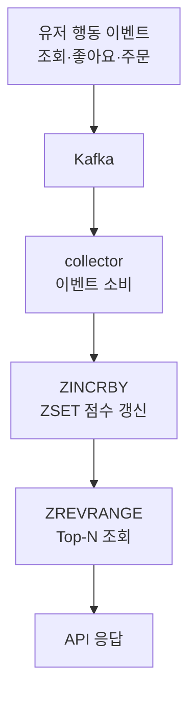

실시간 랭킹은 조회 빈도가 매우 높은데, RDB의 `GROUP BY + ORDER BY` 는 데이터가 쌓일수록 느려지고 DB 과부하로 이어집니다. 그래서 랭킹엔 보통 **Redis Sorted Set(ZSET)**을 씁니다.

## ZSET — 정렬을 내장한 자료구조

`(member, score)` 쌍을 **score 기준 정렬 상태로 유지**하는 자료구조입니다. 삽입·수정이 O(log N), Top-N 조회가 빠르고, 별도 인덱스 없이 정렬을 내장합니다. Top-N·특정 멤버 순위·score 범위 조회를 모두 지원해요.

| 방법 | 장점 | 단점 |
| --- | --- | --- |
| DB ORDER BY | 정합성 높음 | 느림, 부하 큼 |
| 캐시 + 정렬 | 간단 | 매 요청 정렬 |
| Redis ZSET | 정렬 내장, 빠름 | 메모리 사용 |

```text
ZADD rank:all:20250907 100 product:101
ZREVRANGE rank:all:20250907 0 9 WITHSCORES
ZREVRANK rank:all:20250907 product:101
```

## 이벤트로 실시간 집계

`commerce-api` 가 조회·좋아요·주문 같은 행동 이벤트를 Kafka로 발행하면, `collector` 가 소비해 ZSET 점수를 실시간 갱신합니다. API는 ZSET을 **조회만** 하므로 집계 부담과 조회 부담이 분리돼요.



## 시간의 양자화와 가중치

랭킹은 "언제부터 언제까지"가 명확해야 의미가 있습니다. `rank:all:20250906` 처럼 **일별로 키를 분리**하면 리셋·만료가 쉽고, 오래전 점수를 쌓은 상품이 상위를 독식하는 롱테일을 막습니다. TTL은 윈도우의 1.5~2배가 안정적이에요.

좋아요·구매·매출은 스케일이 다르므로 **가중치 합산**으로 단일 스코어를 만듭니다. 구매 결정에 가까운 지표일수록 높게 — 예: view 0.1, like 0.2, order 0.7.

<div class="callout callout-q"><span class="callout-label">한 걸음 더</span>새 집계 윈도우가 시작되면 점수가 0이라 랭킹이 비는 <b>콜드 스타트</b>가 생깁니다. <code>ZUNIONSTORE</code>로 전날 점수에 작은 가중치(예: 0.1)를 곱해 새 키에 미리 복사하면(Score Carry-Over), 빈 랭킹을 막으면서 오늘 점수가 위로 올라갈 여지를 남깁니다.</div>

## 참고

- [Redis Sorted Set으로 랭킹 관리 — Medium](https://medium.com/sjk5766/redis-sorted-set%EC%9D%84-%EC%9D%B4%EC%9A%A9%ED%95%9C-%EB%9E%AD%ED%82%B9-%EA%B4%80%EB%A6%AC-38d28712a8b9)
- [RedisGate — Sorted Sets](https://redisgate.kr/redis/command/zsets.php)
- [Spring Data Redis — Template](https://docs.spring.io/spring-data/redis/reference/redis/template.html)
