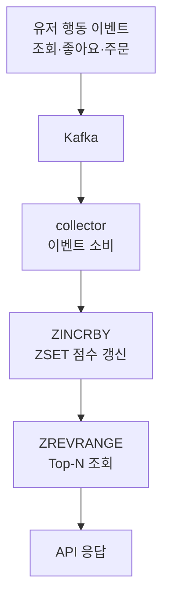

실시간 랭킹은 조회 빈도가 매우 높은데, RDB의 `GROUP BY + ORDER BY` 는 데이터가 쌓일수록 느려지고 DB 과부하로 이어집니다. 그래서 랭킹엔 보통 **Redis Sorted Set(ZSET)**을 씁니다.

## ZSET — 정렬을 내장한 자료구조

`(member, score)` 쌍을 **score 기준으로 항상 정렬된 상태로 유지**하는 자료구조입니다. 핵심은 _정렬을 미리 해두고 산다_ 는 점 — 점수를 넣거나 바꿀 때마다 제자리에 끼워 넣으므로, 조회 시점엔 이미 정렬돼 있어 따로 줄 세울 필요가 없어요. 점수 하나를 갱신하는 비용은 데이터가 100만 개라도 약 20번의 비교면 끝납니다(O(log N) — 전체를 훑는 게 아니라 절반씩 좁혀 들어가는 비용). Top-N·특정 멤버 순위·점수 범위 조회를 모두 지원합니다.

| 방법 | 장점 | 단점 |
| --- | --- | --- |
| DB ORDER BY | 정합성 높음 | 느림, 부하 큼 |
| 캐시 + 정렬 | 간단 | 매 요청 정렬 |
| Redis ZSET | 정렬 내장, 빠름 | 메모리 사용 |

```text
ZADD rank:all:20250907 100 product:101
ZREVRANGE rank:all:20250907 0 9 WITHSCORES
ZREVRANK rank:all:20250907 product:101
```

## 이벤트로 실시간 집계

`commerce-api` 가 조회·좋아요·주문 같은 행동 이벤트를 Kafka로 발행하면, `collector` 가 소비해 ZSET 점수를 실시간 갱신합니다. API는 ZSET을 **조회만** 하므로 집계 부담과 조회 부담이 분리돼요.



## 기간을 잘라서 본다

랭킹은 "언제부터 언제까지"가 명확해야 의미가 있습니다. 점수를 한 키에 무한정 쌓으면, **오래전부터 점수를 모은 상품이 영원히 1등**을 차지하고 신상품은 올라올 기회를 잃어요(예전 인기에 갇히는 현상). 그래서 `rank:all:20250906` 처럼 **날짜별로 키를 따로** 둡니다. 하루가 지나면 새 키에서 다시 시작하니 리셋·만료가 쉽고 그날의 인기가 반영돼요. 키에 거는 만료 시간(TTL)은 집계 기간의 1.5~2배 정도가 안정적입니다.

좋아요·구매·매출은 스케일이 다르므로 **가중치 합산**으로 단일 스코어를 만듭니다. 구매 결정에 가까운 지표일수록 높게 — 예: view 0.1, like 0.2, order 0.7.

<div class="callout callout-q"><span class="callout-label">한 걸음 더</span>새 집계 윈도우가 시작되면 점수가 0이라 랭킹이 비는 <b>콜드 스타트</b>가 생깁니다. <code>ZUNIONSTORE</code>로 전날 점수에 작은 가중치(예: 0.1)를 곱해 새 키에 미리 복사하면(Score Carry-Over), 빈 랭킹을 막으면서 오늘 점수가 위로 올라갈 여지를 남깁니다.</div>

## 참고

- [Redis Sorted Set으로 랭킹 관리 — Medium](https://medium.com/sjk5766/redis-sorted-set%EC%9D%84-%EC%9D%B4%EC%9A%A9%ED%95%9C-%EB%9E%AD%ED%82%B9-%EA%B4%80%EB%A6%AC-38d28712a8b9)
- [RedisGate — Sorted Sets](https://redisgate.kr/redis/command/zsets.php)
- [Spring Data Redis — Template](https://docs.spring.io/spring-data/redis/reference/redis/template.html)
