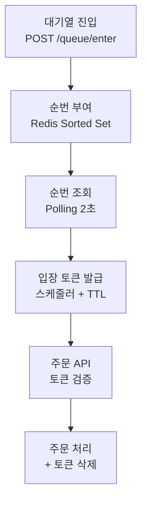

초당 100건이 갑자기 10,000건으로 튀면, DB 커넥션·스레드 풀이 한계를 넘어 전체 장애로 번집니다. 서버를 10배 늘려도 DB·PG는 스케일이 제한적이고, 피크가 짧고 높으면 오토스케일링이 반응하기 전에 터져요. 그래서 **대기열**이 등장합니다.

## 대기열은 back-pressure다

핵심은 "하류(DB·PG)가 감당할 수 있는 속도만큼만 상류(유저 요청)를 흘려보내는" **back-pressure**. 대기열이 이를 구현하는 대표적 방법입니다.

## 거부할까, 기다리게 할까

| 구분 | Rate Limiting | Queuing |
| --- | --- | --- |
| 초과 요청 | 거부(429) | 보관(적재) |
| 유저 경험 | "나중에 다시" | "현재 512번째" |
| 반응 | 재시도 폭풍 | 순서대로 처리 |
| 적합 | API 보호·봇 차단 | 행사 트래픽 |

둘은 양자택일이 아닙니다. 봇·비정상 요청을 Rate Limiting으로 거른 뒤, 정상 유저만 대기열에 넣는 식으로 조합해요.

## Redis Sorted Set + 입장 토큰

`score = 진입 timestamp` 로 먼저 온 사람이 앞 순번, `member = userId` 라 중복 진입이 자동 방지됩니다. 스케줄러가 주기적으로 앞에서 N명을 꺼내 **TTL 있는 입장 토큰**을 발급하고, 토큰 보유자만 주문 API에 진입합니다. TTL이 지나면 자동 만료되어 다음 사람에게 기회가 넘어가요.

```text
ZADD  waiting-queue {ts} {userId}    -- 진입
ZRANK waiting-queue {userId}         -- 순번 조회 (μs)
ZPOPMIN waiting-queue {N}            -- 앞에서 N명
SET entry-token:{userId} {t} EX 300  -- 5분 토큰
```

순번이 안 보이면 유저는 새로고침하거나 이탈합니다. **Polling** 은 단순하지만 대기 인원이 많으면 그 자체가 부하, **SSE** 는 변경 시에만 push하지만 커넥션을 유지해야 해요. Polling으로 시작해 부하가 문제되면 SSE로 전환하는 걸 권합니다. "약 N분 남았습니다"가 순번 숫자보다 이탈 방지에 효과적이고요.

## Thundering Herd 주의

스케줄러가 1초마다 175명에게 토큰을 _한꺼번에_ 발급하면, 175명이 동시에 주문 API를 때려 순간 스파이크가 생깁니다 — 원래 문제의 축소판이죠. 발급 간격 분산(100ms마다 ~18명), 토큰 Jitter(0~2초 랜덤 딜레이), 주문 API 자체 Rate Limit으로 완화합니다.



<div class="callout callout-q"><span class="callout-label">기억할 것</span>대기열은 피크를 <b>평탄화(smoothing)</b>할 뿐 부하를 없애지 않습니다. 하류(DB·PG)의 한계를 항상 염두에 두고, 핵심 인프라인 Redis가 죽었을 때의 동작(차단·우회·Fallback)을 <em>사전에</em> 정의해두세요 — 장애 후 판단하면 늦습니다.</div>

## 참고

- [지마켓 대기열 시스템 파헤치기 — GMarket Dev](https://dev.gmarket.com/46)
- [Virtual Waiting Room Architecture — System Design](https://newsletter.systemdesign.one/p/virtual-waiting-room)
- [Redis Sorted Sets 공식 문서](https://redis.io/docs/latest/develop/data-types/sorted-sets/)
- [Server-Sent Events in Spring — Baeldung](https://www.baeldung.com/spring-server-sent-events)
