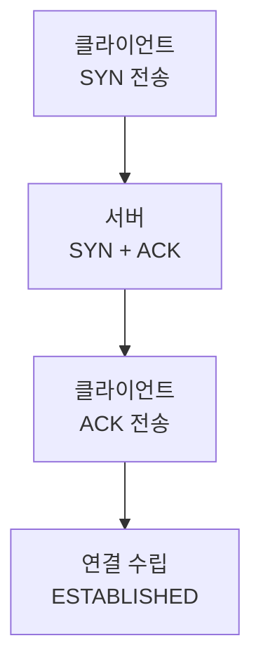

TCP는 데이터를 보내기 전에 먼저 **연결을 맺습니다.** 이 과정이 3-way handshake — 세 번의 패킷으로 서로 "보낼 준비, 받을 준비"가 됐음을 확인합니다.

## 왜 세 번인가

연결은 **양방향** 입니다. 클라이언트→서버 방향과 서버→클라이언트 방향, 둘 다 열려 있음을 확인해야 합니다. 그래서 최소 세 번의 교환이 필요합니다.

## 각 단계의 의미

| 단계 | 패킷 | 뜻 |
| --- | --- | --- |
| 1 | SYN | "나 보낼게, 시작 번호는 x" |
| 2 | SYN + ACK | "받았어. 나도 보낼게, 번호는 y" |
| 3 | ACK | "확인. 이제 시작하자" |

왜 ACK가 또 필요할까2번까지면 서버→클라이언트 방향만 검증됩니다. 3번 ACK가 있어야 <b>클라이언트→서버 방향</b>도 살아 있음이 확인돼, 한쪽만 열린 반쪽 연결을 막습니다.

연결을 끊을 땐 비슷하지만 4-way handshake(FIN/ACK를 양쪽이 각각)로 정리합니다. 보내는 방향과 받는 방향을 따로 닫기 때문이에요.
