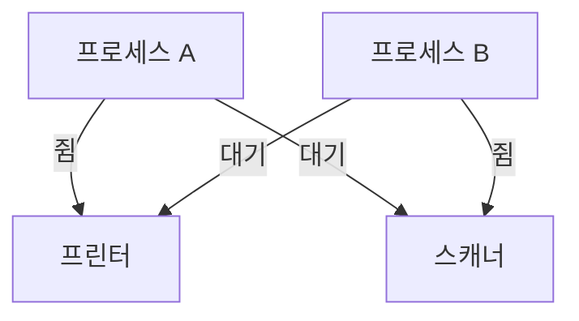

A는 프린터를 쥔 채 스캐너가 나기를 기다리고, B는 스캐너를 쥔 채 프린터가 나기를 기다립니다. 둘 다 상대가 먼저 놓기만 바라며 영원히 멈춰요. 이게 **데드락**(교착 상태)입니다.

## 네 가지가 동시에 충족되면 갇힌다

데드락은 다음 네 조건이 _모두_ 맞을 때만 생깁니다.

- **상호 배제**: 자원을 한 번에 하나만 쓸 수 있다
- **점유와 대기**: 자원을 쥔 채로 다른 자원을 기다린다
- **비선점**: 남이 쥔 자원을 강제로 뺏을 수 없다
- **순환 대기**: 대기 관계가 고리를 이룬다

뒤집으면, 네 조건 중 _하나만_ 깨도 데드락은 일어나지 않습니다. 해법은 모두 여기서 나와요.

## 푸는 방법은 셋

- **예방**: 네 조건 중 하나를 원천 차단. 예를 들어 필요한 자원을 처음에 한꺼번에 요청하게 하면 "점유와 대기"가 사라집니다.
- **회피**: 자원을 줘도 안전한지 매번 따져 보고, 안전할 때만 할당. 대표가 **은행원 알고리즘** 입니다.
- **탐지와 회복**: 일단 허용하되 주기적으로 순환을 찾아, 발견되면 한쪽을 강제 종료하거나 자원을 회수해 고리를 끊습니다.

## 은행원 알고리즘 한 줄

요청을 들어줬다고 가정했을 때, 모든 프로세스가 끝까지 자원을 받아 완료할 수 있는 _안전한 순서_ 가 하나라도 있으면 할당하고, 없으면 보류합니다.

한 걸음 더실무에서는 예방이나 회피보다 <b>락을 항상 같은 순서로 잡기</b>가 가장 흔한 처방입니다. 순환 대기를 원천에서 막거든요. 데이터베이스도 데드락을 탐지하면 한쪽 트랜잭션을 victim으로 골라 롤백해 풀어줍니다.

## 참고

- [운영체제 교과서 OSTEP (무료)](https://pages.cs.wisc.edu/~remzi/OSTEP/)
- [교착 상태 — 위키백과](https://ko.wikipedia.org/wiki/교착_상태)
