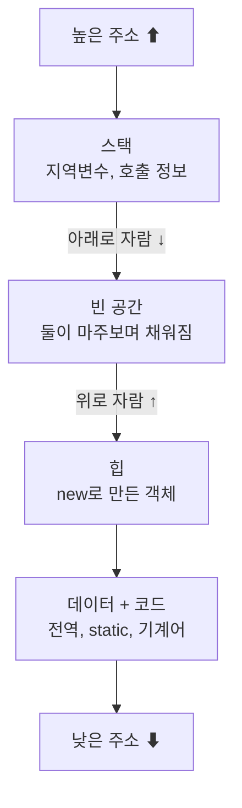

프로그램은 디스크에 잠든 코드 덩어리일 뿐입니다. 실행하면 OS가 그 코드를 메모리에 올리고 CPU를 할당받을 수 있는 상태로 만드는데, 이렇게 **살아 움직이는 프로그램** 이 프로세스예요. 프로세스가 쓰는 메모리부터 들여다봅니다.

## 프로세스의 메모리는 네 칸이다

한 프로세스의 주소 공간은 역할이 다른 네 영역으로 나뉩니다.

- **코드**(Text): 실행할 기계어. 바뀔 일이 없어 읽기 전용.
- **데이터**(Data): 전역 변수, 정적 변수. 초기화 안 된 것은 BSS로 따로 묶임.
- **힙**(Heap): 실행 중 동적으로 할당하는 공간. 위로 자랍니다.
- **스택**(Stack): 함수 호출 정보와 지역 변수. 아래로 자랍니다.

힙과 스택이 가운데 빈 공간을 사이에 두고 서로를 향해 자라다, 맞닿으면 메모리가 터집니다.

## PCB, OS가 프로세스를 기억하는 수첩

OS는 프로세스마다 **PCB**(Process Control Block) 하나를 들고 관리합니다. 여기엔 프로세스 상태, 다음에 실행할 위치(PC), 레지스터 값, 메모리 정보 등이 담겨요. 프로세스를 잠시 멈췄다 나중에 _이어서_ 실행하려면 이 수첩이 꼭 필요합니다.

## 컨텍스트 스위치, 갈아탈 때 치르는 비용

CPU가 프로세스 A에서 B로 넘어갈 때, A의 레지스터와 PC를 A의 PCB에 저장하고 B의 것을 복원합니다. 이 교체 작업이 **컨텍스트 스위치** 인데, 그동안 CPU는 정작 일을 못 해요. 순수한 오버헤드라 너무 잦으면 스위칭 비용만 쌓입니다.

한 걸음 더자식 프로세스가 끝났는데 부모가 결과를 회수(wait)하지 않으면 <b>좀비</b>로 남고, 반대로 부모가 먼저 죽으면 자식은 <b>고아</b>가 돼 init 프로세스가 입양해 정리합니다. 둘 다 PCB가 회수되지 않으면 메모리 누수로 이어지므로, 부모가 자식의 종료를 제대로 거둬야 합니다.

## 참고

- [운영체제 교과서 OSTEP (무료)](https://pages.cs.wisc.edu/~remzi/OSTEP/)
- [프로세스 — 위키백과](https://ko.wikipedia.org/wiki/프로세스_(컴퓨팅))
