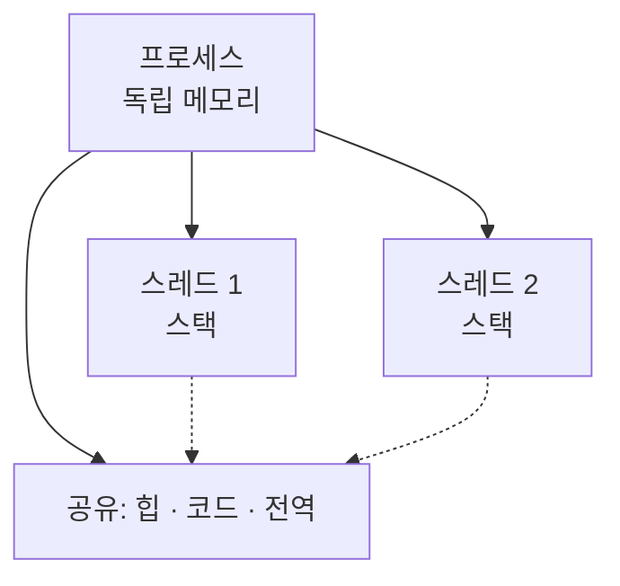

프로세스와 스레드의 차이는 한 문장으로 — **프로세스는 격리, 스레드는 공유** 입니다. 이 차이가 메모리 모델과 동시성 버그의 성격을 가릅니다.

## 메모리를 어떻게 나누나

프로세스는 각자 독립된 메모리 공간(코드·힙·스택)을 가집니다. 한 프로세스가 죽어도 다른 프로세스엔 영향이 없죠. 스레드는 같은 프로세스 안에서 **힙을 공유** 하고 스택만 따로 가집니다.

| 구분 | 프로세스 | 스레드 |
| --- | --- | --- |
| 메모리 | 독립 | 힙 공유 |
| 통신 | IPC 필요 | 변수 직접 공유 |
| 전환 비용 | 큼 | 작음 |
| 장애 격리 | 강함 | 약함 (하나 죽으면 전체) |

동시성의 씨앗스레드가 힙을 공유하기 때문에 <b>경쟁 조건(race condition)</b>이 생깁니다. 그래서 공유 자원 접근에 락·원자 연산·불변 객체 같은 동기화가 필요해지는 거예요.

