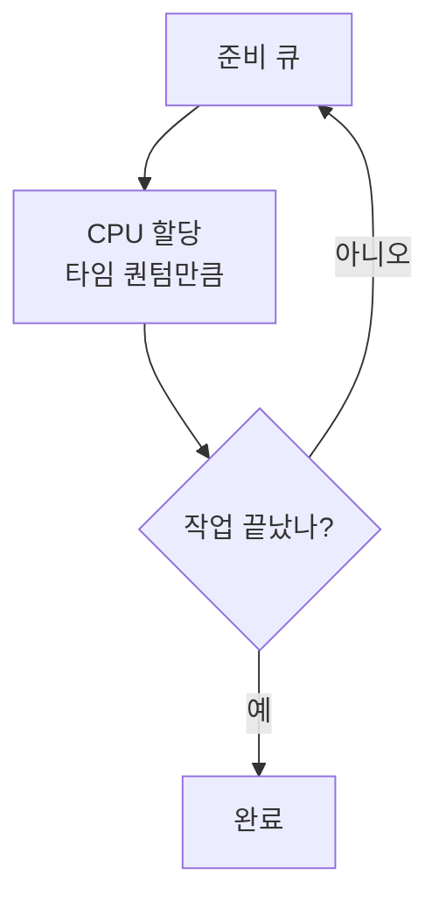

코어는 몇 개뿐인데 실행을 기다리는 프로세스는 수백 개입니다. 누구에게 CPU를 언제, 얼마나 줄지 정하는 일이 **스케줄링** 이에요. 기준에 따라 응답성도, 공정함도 달라집니다.

## 선점이냐, 비선점이냐

가장 큰 갈림길은 실행 중인 프로세스를 도중에 뺏을 수 있느냐입니다.

- **비선점**(non-preemptive): 한 번 CPU를 받으면 끝나거나 스스로 놓을 때까지 보유. 단순하지만 짧은 작업이 긴 작업 뒤에서 한참 굶습니다.
- **선점**(preemptive): OS가 중간에 강제로 회수. 응답성은 좋아지지만 컨텍스트 스위치 비용이 따라옵니다.

## 대표 알고리즘 넷

| 알고리즘 | 방식 | 약점 |
| --- | --- | --- |
| FCFS | 먼저 온 순서대로 | 긴 작업이 앞을 막음(convoy) |
| SJF | 짧은 작업 먼저 | 실행 시간 예측이 어려움 |
| Round Robin | 타임 퀀텀씩 돌아가며 | 퀀텀 작으면 스위칭 폭증 |
| Priority | 우선순위 높은 순 | 낮은 순위가 굶음 |

## 굶주림과 노화

**Starvation**(기아)은 낮은 우선순위 프로세스가 계속 밀려 영영 실행되지 못하는 상태입니다. 해법은 **Aging**(노화) — 오래 기다린 프로세스의 우선순위를 조금씩 올려, 언젠가는 차례가 오게 만드는 거예요.

한 걸음 더실무 OS는 알고리즘 하나로 돌지 않습니다. 우선순위별로 여러 큐를 두고, CPU를 많이 쓴 프로세스는 낮은 큐로 강등하는 <b>멀티레벨 피드백 큐</b>를 씁니다. 그러면 짧게 쓰고 빠지는 대화형 작업이 자연스럽게 우대돼, 사용자가 체감하는 반응 속도가 좋아집니다.

## 참고

- [운영체제 교과서 OSTEP (무료)](https://pages.cs.wisc.edu/~remzi/OSTEP/)
- [CPU Scheduling — GeeksforGeeks](https://www.geeksforgeeks.org/cpu-scheduling-in-operating-systems/)
