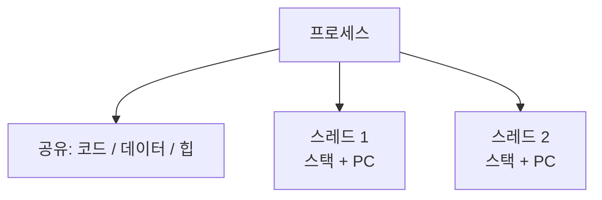

크롬에서 탭 하나가 멈춰도 다른 탭은 멀쩡한 이유, 그리고 한 탭 안에서 스크롤과 이미지 로딩이 _동시에_ 되는 이유. 둘은 각각 프로세스와 스레드로 설명됩니다.

## 프로세스는 격리, 스레드는 공유

프로세스는 저마다 독립된 메모리 공간을 가집니다. 반면 스레드는 한 프로세스 _안에서_ 코드, 데이터, 힙을 함께 쓰고, 스택과 레지스터(PC)만 따로 가져요.

| 구분 | 프로세스 | 스레드 |
| --- | --- | --- |
| 메모리 | 완전 독립 | 코드/데이터/힙 공유 |
| 통신 비용 | 비쌈(IPC 필요) | 쌈(메모리 공유) |
| 생성/전환 | 무거움 | 가벼움 |
| 장애 격리 | 서로 안전 | 하나 죽으면 전체 위험 |

## 왜 스레드마다 스택은 따로일까

스택에는 _지금 어느 함수를 거쳐 어디까지 실행했는지_ 가 쌓입니다. 스레드는 저마다 다른 함수를 독립적으로 실행하니 호출 경로가 제각각이에요. 그래서 코드와 힙은 공유해도, 실행 위치(PC)와 호출 스택만큼은 스레드마다 가져야 합니다.

## 멀티스레딩, 싸지만 위험하다

한 작업을 여러 스레드로 쪼개면 생성과 전환이 프로세스보다 가볍고 통신도 쉽습니다. 대신 공유 자원을 동시에 건드리는 순간 결과가 실행 순서에 휘둘리는 **경쟁 상태**(race condition)가 생겨, 뮤텍스 같은 동기화가 필요해져요. 참고로 스레드는 사용자 수준(라이브러리가 관리)과 커널 수준(OS가 직접 관리)으로도 나뉩니다.

KEY POINT스레드는 메모리를 공유하므로 한 스레드의 잘못된 접근이 <b>프로세스 전체</b>를 무너뜨립니다. 프로세스는 격리돼 있어 하나가 죽어도 옆은 안전하고요. 크롬이 탭을 굳이 별도 프로세스로 띄우는 건 바로 이 <em>장애 격리</em>를 사려는 선택입니다.

## 참고

- [운영체제 교과서 OSTEP (무료)](https://pages.cs.wisc.edu/~remzi/OSTEP/)
- [스레드 — 위키백과](https://ko.wikipedia.org/wiki/스레드_(컴퓨팅))
