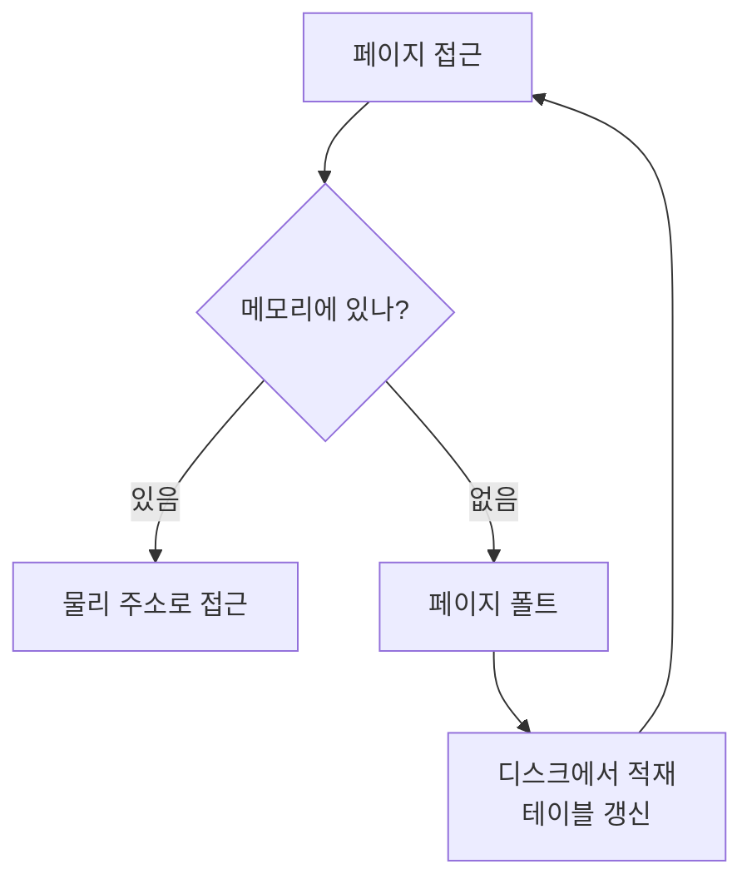

램이 8GB인데 그보다 더 많은 메모리를 요구하는 프로그램들이 동시에 돕니다. 각 프로세스는 메모리를 _혼자 통째로_ 쓰는 것처럼 보지만, 실제로는 OS가 주소를 바꿔치기하는 **가상 메모리** 덕분이에요.

## MMU와 페이지

프로세스가 보는 주소는 가상 주소입니다. 이걸 실제 물리 주소로 바꾸는 일을 하드웨어인 **MMU**(Memory Management Unit)가 맡아요. 메모리는 **페이지** 라는 고정 크기 조각으로 나뉘고, 페이지 테이블이 "가상 페이지 → 물리 프레임" 매핑을 들고 있습니다. 이 매핑을 매번 뒤지면 느리니, 자주 쓰는 것은 **TLB** 라는 캐시에 담아 둡니다.

## 요구 페이징과 페이지 폴트

필요한 페이지만 그때그때 메모리에 올리는 방식이 **요구 페이징** 입니다. 없는 페이지를 건드리면 **페이지 폴트** 가 발생해요.

## 자리가 없으면 누구를 쫓아낼까

프레임이 꽉 차면 교체 알고리즘이 내보낼 페이지를 고릅니다.

- **FIFO**: 먼저 온 것부터. 단순하지만 손해 보는 경우가 있음
- **LRU**: 가장 오래 안 쓴 것. 지역성을 활용해 실무에서 근사 구현
- **OPT**: 앞으로 가장 늦게 쓸 것. 이론상 최적이나 미래를 알아야 해 구현 불가

## 지역성이 가상 메모리를 살린다

방금 쓴 데이터나 그 근처를 곧 다시 쓰는 경향을 **지역성**(locality)이라 합니다. 시간적, 공간적 지역성 덕분에 전체 중 일부 페이지만 올려도 대부분 적중해요. 가상 메모리가 디스크를 들락거리면서도 느리지 않은 근본 이유입니다.

한 걸음 더페이지 폴트가 지나치게 잦아지면 CPU가 일은 안 하고 디스크 스왑만 반복하는 <b>스래싱</b>(thrashing)에 빠집니다. 동시에 실행하는 프로세스 수를 줄이거나, 각 프로세스가 당장 필요한 페이지 묶음(워킹셋)을 확보해 줘야 빠져나옵니다.

## 참고

- [운영체제 교과서 OSTEP (무료)](https://pages.cs.wisc.edu/~remzi/OSTEP/)
- [가상 메모리 — 위키백과](https://ko.wikipedia.org/wiki/가상_메모리)
