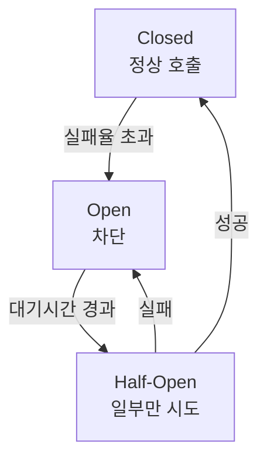

결제(PG) 서버가 멈추면, 끝까지 기다리는 요청들이 스레드와 커넥션을 점유한 채 쌓입니다. 수십·수백 개가 누적되면 _외부에서 시작된_ 장애가 결국 **내 시스템 전체**를 마비시켜요. 핵심 통찰은 하나 — 대부분의 실무 장애는 "실패"가 아니라 **"지연"**에서 시작됩니다.

## 장애는 지연에서 번진다

외부 의존성이 느려지는 순간이 위험의 출발점입니다. 그래서 회복 전략은 "느려지면 빨리 끊고, 반복되면 차단하고, 그래도 안 되면 대신 응답"하는 4겹으로 짭니다.

| 전략 | 막는 문제 | 핵심 설정 |
| --- | --- | --- |
| Timeout | 지연으로 인한 자원 점유 | connect/read, 2~5초 |
| Retry | 일시적 실패(503 등) | max-attempts, backoff |
| Circuit Breaker | 반복 실패 시 호출 폭주 | failure-rate, 3상태 |
| Fallback | 모든 시도 실패 후 응답 | fallbackMethod |

**Timeout** 은 가장 기본 방패입니다. HTTP(Feign), DB 풀(Hikari), Redis(Lettuce)까지 인프라마다 따로 걸어야 해요 — 안 걸면 무기한 대기합니다. **Retry** 는 일시적 실패에 효과적이지만, 무작정 재시도하면 서버에 더 큰 부하를 줍니다. 반드시 **backoff(대기)와 최대 횟수**를 두세요.

## 서킷브레이커 3상태

누전 차단기처럼, 반복 실패하면 회로를 열어 호출 자체를 차단합니다.



<div class="callout callout-q"><span class="callout-label">핵심</span>서킷브레이커는 성공/실패만 보지 않습니다. <code>slow-call-duration-threshold</code>로 <b>느린 응답도 실패로 집계</b>할 수 있어요. 지연이 곧 장애의 출발점이라는 통찰과 정확히 맞닿는 설정입니다.</div>

## 조합 — Resilience4j

세 전략(Retry·CircuitBreaker·TimeLimiter)을 함께 써야 강력합니다. 모든 방패가 뚫렸을 때 **Fallback** 이 "현재 가능한 대응"(예: '결제 대기 상태')을 정의해 UX를 지킵니다.

```yaml
resilience4j:
  circuitbreaker:
    instances:
      pgCircuit:
        failure-rate-threshold: 50
        wait-duration-in-open-state: 10s
        slow-call-duration-threshold: 2s
        slow-call-rate-threshold: 50
```

```java
@CircuitBreaker(name = "pgCircuit", fallbackMethod = "fallback")
public PaymentResponse pay(PaymentRequest req) {
    return pgClient.requestPayment(req);
}

public PaymentResponse fallback(PaymentRequest req, Throwable t) {
    return new PaymentResponse("결제 대기 상태", false);
}
```

## 참고

- [Resilience4j Getting Started](https://resilience4j.readme.io/docs/getting-started)
- [Resilience4j with Spring Boot — Baeldung](https://www.baeldung.com/spring-boot-resilience4j)
- [Feign Client Timeouts — Baeldung](https://www.baeldung.com/feign-timeout)
- [Fallback Pattern — Microservices Architecture](https://badia-kharroubi.gitbooks.io/microservices-architecture/content/patterns/communication-patterns/fallback-pattern.html)
