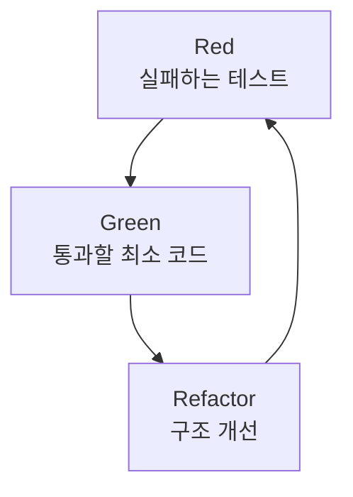

테스트를 _나중에_ 붙이려다 "이 코드는 테스트가 안 되는데?"를 마주친 적 있다면, TDD는 그 순간을 앞당겨 줍니다. 본질은 "테스트를 먼저 쓰느냐"가 아니라 **설계 단위가 검증 가능하냐**예요.

## 테스트 피라미드

범위에 따라 역할이 갈립니다. 아래로 갈수록 빠르고 많이, 위로 갈수록 느리지만 신중하게.

- **단위** — 도메인 모델(Entity, VO, Service)의 순수 로직을 Spring 없이 순수 JVM에서 검증
- **통합** — `@SpringBootTest` 로 Repository, 도메인, 외부 Stub이 연결된 흐름 검증
- **E2E** — `MockMvc`/`TestRestTemplate` 로 Controller→Service→DB까지 실제 HTTP 시나리오 검증

## 테스트 더블 — 역할 vs 도구

가장 흔한 혼동: `mock()`, `spy()` 는 **도구(생성 방식)**, Dummy, Stub, Mock, Spy, Fake는 **역할**(목적)입니다. 하나의 mock 객체에 Stub 역할과 Mock 역할을 동시에 줄 수 있어요.

| 역할 | 목적 | 예시 |
| --- | --- | --- |
| Dummy | 자리만 채움 | `new User(null, null)` |
| Stub | 고정 응답 (상태 기반) | `when().thenReturn()` |
| Mock | 호출 검증 (행위 기반) | `verify(...)` |
| Spy | 진짜 객체 + 일부 조작 | `spy()` + `doReturn()` |
| Fake | 동작하는 가짜 구현 | `InMemoryUserRepository` |

```java
var repo = mock(UserRepository.class);  // 도구: mock()
when(repo.findById(1L))
    .thenReturn(new User(...));         // 역할: Stub
verify(repo).findById(1L);              // 역할: Mock
```

## 테스트하기 어려운 구조의 신호

내부에서 의존 객체를 `new` 로 직접 만들면 대역으로 바꿀 수 없어 격리가 깨지고, 한 함수에 책임이 몰리면 실패 원인 추적이 어렵고, 외부 API, DB가 하드코딩되면 실제 환경 없이 테스트할 수 없습니다. private 로직, static 남용도 단위 테스트를 막아요.

## 테스트 가능하게 바꾸는 법

① 외부 의존성을 인터페이스화하고 **생성자 주입(DI)**, ② 비즈니스 로직은 도메인/전용 Service로 **위임**, ③ 한 함수는 한 역할, ④ "입력→상태 변화→결과" 구조로 정리. 직접 Repository를 생성하던 코드를 위임 구조로 바꾸면 `UserTest`, `ProductTest`, `OrderServiceTest` 로 쪼개 검증할 수 있습니다.

```java
class OrderService {
    private final UserReader userReader;
    private final ProductReader productReader;
    private final OrderRepository orderRepository;

    void completeOrder(OrderCommand cmd) {
        User user = userReader.get(cmd.userId());
        Product product = productReader.get(cmd.productId());
        product.decreaseStock();
        user.pay(product.getPrice());
        orderRepository.save(new Order(user, product));
    }
}
```



<div class="callout callout-tip"><span class="callout-label">KEY POINT</span>TDD의 핵심은 "테스트를 먼저 쓰느냐"가 아니라 <b>설계 단위를 잘게 쪼개 검증 가능하게 만들었느냐</b>입니다. 그리고 mock 객체 하나에 Stub(응답 통제)과 Mock(호출 검증) 역할을 함께 줄 수 있다는 점이 더블 이해의 출발점이에요.</div>

## 참고

- [Test Pyramid — Martin Fowler](https://martinfowler.com/bliki/TestPyramid.html)
- [JUnit 5 User Guide](https://junit.org/junit5/docs/current/user-guide/)
- [Mockito 공식 문서](https://site.mockito.org/)
- [Spring Boot Testing](https://docs.spring.io/spring-boot/docs/current/reference/html/features.html#features.testing)
